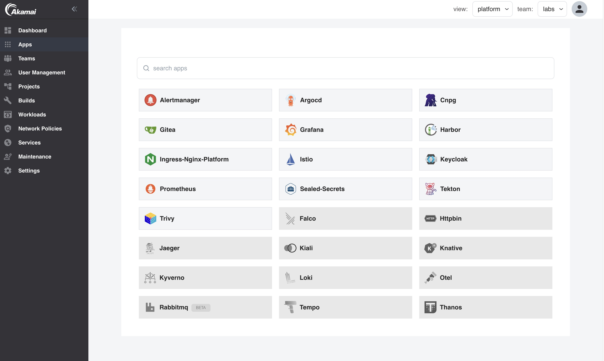

## Application Platform for Linode Kubernetes Engine (LKE) integrated Applications

Enable all the Kubernetes Applications you need with just one click!

---
### Image Build and CI/CD

### [Argo CD](argocd.md)
Declarative GitOps Continuous Delivery for Kubernetes

### [Gitea](gitea.md)
Gitea is a painless self-hosted Git service.

### [Tekton](tekton.md)
Tekton Pipelines provides Kubernetes custom resources for declaring CI/CD-style pipelines.

### [Harbor](harbor.md)
Harbor is a cloud native registry that stores, signs, and scans content.

### [Knative](knative.md)
Knative Serving builds on Kubernetes to support deploying and serving of applications and functions as serverless containers.

---

### Security, Compliance & Key Management

### [Kyverno](kyverno.md)
Kyverno is a policy engine designed for Kubernetes. It can validate, mutate, and generate configurations using admission controls and background scans.

### [Trivy Operator](trivy.md)
Trivy Operator continuously scans your Kubernetes cluster for security issues, and generates security reports as Kubernetes Custom Resources.

### [Keycloak](keycloak.md)
Keycloak is an Open Source Identity and Access Management solution for modern Applications and Services.

### [Cert-Manager](certmanager.md)
X.509 certificate management for Kubernetes.

### [Sealed Secrets](sealedsecrets.md)
Sealed Secrets is a Kubernetes Custom Resource Definition Controller which allows you to store even sensitive information in Git repositories.

### [Falco](falco.md)
Falco is an open source cloud native runtime security tool that makes it easy to consume kernel events, and enrich those events with information from Kubernetes.

### [ExternalDNS](external-dns)
ExternalDNS synchronizes exposed Kubernetes Services and Ingresses with DNS providers.

---

### Monitoring, Logging & Tracing

### [Prometheus](prometheus.md)
Prometheus monitors systems and services by collecting metrics from targets at intervals, evaluating rules, displaying results, and triggering alerts for specified conditions.

### [Alertmanager](alertmanager.md)
Alertmanager handles alerts sent by client applications such as Prometheus.

### [Grafana Loki](loki.md)
Loki is a horizontally-scalable, highly-available, multi-tenant log aggregation system inspired by Prometheus.

### [Grafana](grafana.md)
Grafana allows you to query, visualize, alert on and understand your metrics no matter where they are stored.

### [Kiali](kiali.md)
Kiali is a management console for Istio to manage, visualize, validate and troubleshoot the service mesh.

### [Jaeger](jaeger.md)
Jaeger is a distributed tracing platform.

### [Grafana Tempo](tempo.md)
Grafana Tempo is an open source, easy-to-use and high-scale distributed tracing backend.

### [Open Telemetry Operator](otel.md)
The Open Telemetry Operator offers a vendor-agnostic implementation on how to receive, process and export telemetry data.

---

### Service Mesh & Proxy

### [Istio](istio.md)
Istio is a Service Mesh for providing a uniform way to integrate microservices, manage traffic flow across microservices, enforce policies and aggregate telemetry data.

### [Nginx Ingress Controller](ingress-nginx.md)
Nginx Ingress Controller is an Ingress controller for Kubernetes using NGINX as a reverse proxy and load balancer.

---

### Streaming & Messaging

### [RabbitMQ](rabbitmq.md)
RabbitMQ is the most widely deployed open source message broker.

---

### Scheduling

### [Kured](kured.md)
Kured (KUbernetes REboot Daemon) is a Kubernetes daemonset that performs safe automatic node reboots when the need to do so is indicated by the package management system of the underlying OS.

---

### Cloud Native Storage

### [Velero](velero.md)
Velero is a tool to back up and restore Kubernetes cluster resources and persistent volumes.

### [CloudNative PG](cloudnativepg.md)
CloudNative PostgreSQL is an open source operator designed to manage PostgreSQL workloads on Kubernetes.

### [Minio](minio.md)
MinIO is a High Performance Object Storage and its API is compatible with the Amazon Web Services S3 cloud storage service.

