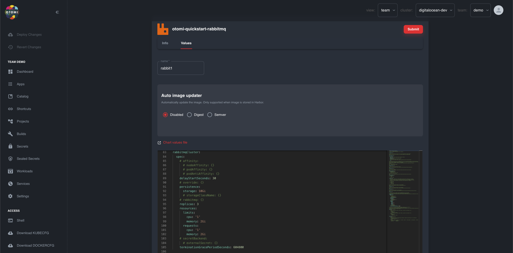
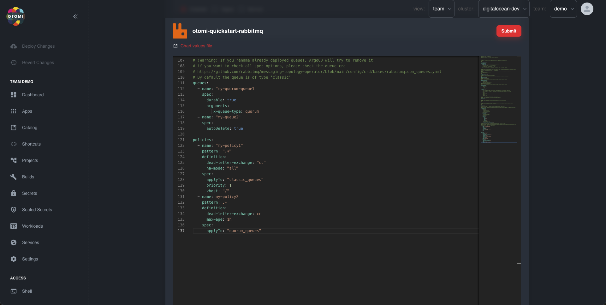
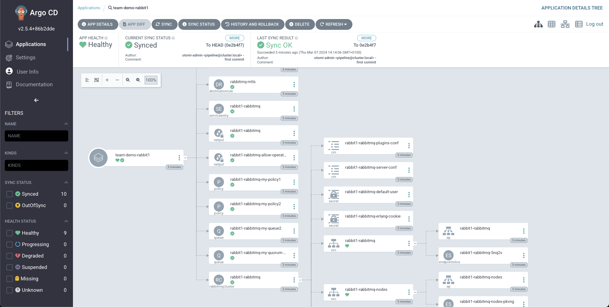

Kubernetes operator to deploy and manage RabbitMQ clusters.

## Overview

[RabbitMQ](https://github.com/rabbitmq/cluster-operator) is a controller and custom resource definition (CRD) designed for the lifecycle (creation, upgrade, graceful shutdown) of a RabbitMQ cluster.

## Creating RabbitMQ Clusters

:::info ALERT
Activate RabbitMQ App in the Apps Panel or ask your administrator.
:::

To create a RabbitMQ Cluster, on the team overview click on the `Catalog` in the sidebar and select the `RabbitMQ` workload. This will take you to the page with the readme where you can see all specifications and definitions that you can use to create your RabbitMQ Cluster with Queues and Policies.


To configure the RabbitMQ Cluster workload go to the `Values` tab and fill in a name for the RabbitMQ Cluster workload. For example we created a rabbitMQ Cluster workload with the name `rabbit1` with 2 `queues` and 2 `policies`.




:::info ALERT
Do remember that even though these values can be edited afterwards, not all specifications or definitions can be updated after a `queue` or `policy` has been created. Please make sure everything is filled in correctly.
:::

When everything is filled in correctly you can `submit` and click the `deploy changes` button.

To check the status deployment you can check the `tekton` pipeline and afterwards you can check the creation of the rabbitMQ pods and containers in ArgoCD.

Tekton:


ArgoCD


## Accessing the RabbitMQ Management UI

To access the `RabbitMQ Management UI` you have to retrieve the default user credentials and `port-forward` the `rabbitMQ server`.
To do this connect to your k8s cluster with `kubectl`.

:::info ALERT
In this example the `rabbitMQ cluster` was created in the admin team so we have to get the `secret` from the `team-admin` namespace. Please retrieve the `secret` from the namespace where the `rabbitMQ cluster` was created.
:::

To retrieve the username and decode it from base64 use the following command:

```
kubectl get secret rabbit1-rabbitmq-default-user -n team-admin -o jsonpath="{.data.username}" | base64 --decode
```

To retrieve the password and decode it from base64 use the following command:

```
kubectl get secret rabbit1-rabbitmq-default-user -n team-admin -o jsonpath="{.data.password}" | base64 --decode
```

Which looks like the this:


:::info ALERT
Make sure you don't copy the `%` symbol at the end.
:::

Now you have to `port-forward` the rabbitmq `container` with port number `15672` that is inside the rabbitmq `pod` called `rabbit1-rabbitmq-server-0` to a random port on your computer that is not used, I use port `56027` for this example.

:::info ALERT
`rabbit1-rabbitmq-server-0` has the prefix `rabbit1` because this is the name that we gave it when creating the workload.
:::

To `port-forward` use the following command:

```
kubectl port-forward -n team-admin rabbit1-rabbitmq-server-0 56027:15672
```

Now you should be able to go to `http://localhost:56027` and use the previously acquired user credentials to log in. If you cannot log in, please check if the credentials are for the correct rabbitMQ cluster.

## Checking the RabbitMQ Management UI

Now that we are logged in you should see the following:


We can also check the `queues` that we specified when creating the rabbitmq cluster.


To see the `policies` that we defined you can see them in the `admin` tab and under `policies`:


## Connecting to the rabbitMQ cluster

To connect to the `rabbitMQ cluster` you use `AMQP` to open a connection. To open a connection you need the `username`, `password`, `host` and `port` of the cluster.

To get the host use the following command:

```
kubectl get secret rabbit1-rabbitmq-default-user -n team-admin -o jsonpath="{.data.host}" | base64 --decode
```

To get the port use the following command:

```
kubectl get secret rabbit1-rabbitmq-default-user -n team-admin -o jsonpath="{.data.port}" | base64 --decode
```
