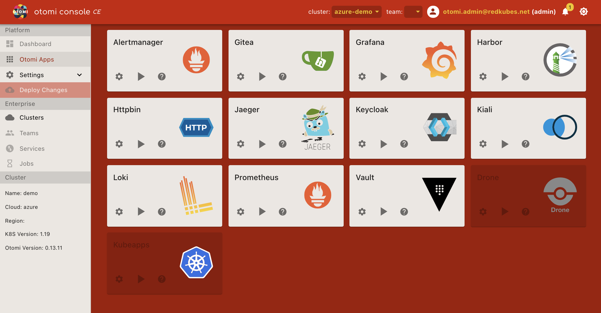

**Otomi Apps** Lists all the apps available to the otomi-admin role. The shortcuts provide direct access to the app in the cluster context.

For each installed App there are three options/buttons

- **Settings**: Not available in CE mode
- **Play**: Run the app.
- **Help**: Get more info about this app

Screenshot (admin role):

