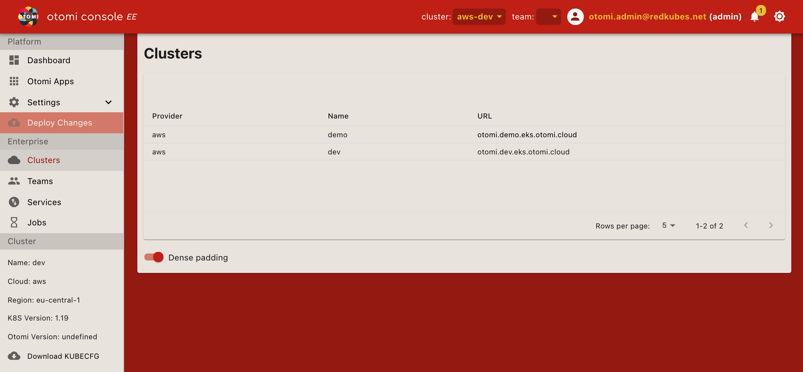

All known Otomi clusters are listed on this page. Clusters can be sorted based on:

| Property | Description                                                           |
| -------- | --------------------------------------------------------------------- |
| Provider | The configured Otomi provider (`AWS`, `Azure`, `Google` or `on-prem`) |
| Name     | The name of the cluster                                               |
| URL      | The URL of the Otomi Console of the cluster                           |

Kubernetes clusters running Otomi can be grouped by adding additional clusters. This enables to switch context between clusters by selecting `Cluster` on the top bar. See the Otomi Console Settings section for more information.
