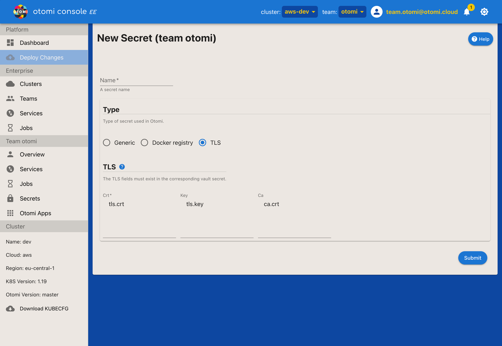

This page describes how to create a secret, and how to edit a secret. Both creating and editing a secret use the same form.

Screenshot:



## Type

What type of secret to deploy/expose. Three options exist:

- [1. Docker Registry](#1-docker-registry)
- [2. Generic](#2-generic)
- [3. TLS](#3-tls)

### 1. Docker Registry

Deploy a docker registry secret. It should exist in Vault as a secret with the same name. The vault secret should be of type "json" and have only one property `.dockerconfigjson` that is set to the value of the following command:
```bash
email="not@us.ed" # can be something else if the registry provider expects it, but usually this is ignored
server="" # example: "https://harbor.demo.eks.otomi.cloud/"
username="" # your username
password="" # your password, can be token
kubectl create secret docker-registry --dry-run=client regcred --docker-email=$email --docker-server=$server --docker-username=$username --docker-password=$password -ojsonpath='{.data.\.dockerconfigjson}' | base64 --decode
```

| Setting  | Description                                                  |
| -------- | ------------------------------------------------------------ |
| Server   | The image registry location                                  |
| Username | The username (for google's gcr.io use '\_json_key')          |
| Password | The password (for google this will be an accounts json blob) |

You can 
### 2. Generic

Deploy a generic kubernetes secret by adding key value pairs.

### 3. TLS

Deploy a kubernetes TLS secret.

| Setting | Description                                    |
| ------- | ---------------------------------------------- |
| crt     | The PEM encoded public key certificate content |
| key     | The private key certificate content            |
| ca      | The CA certificate content                     |
