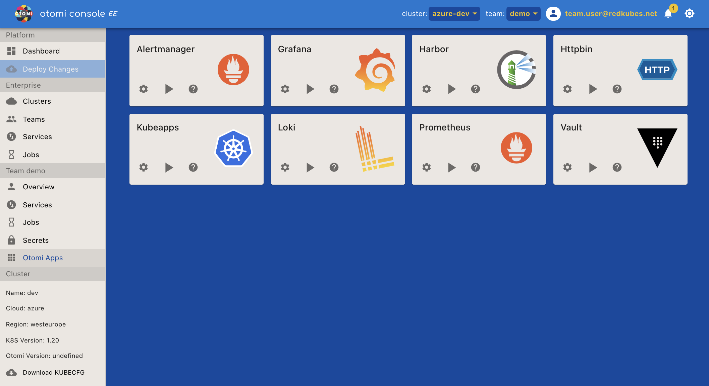

**Otomi Apps** Lists all the apps available to the Team. The team apps give direct access to the team context in that app on that cluster.

For each installed App there are three options/buttons

- **Settings**: [COMING SOON] Change the settings for this app.
- **Play**: Run the app.
- **Help**: Get more info about this app

Screenshot (team role):

