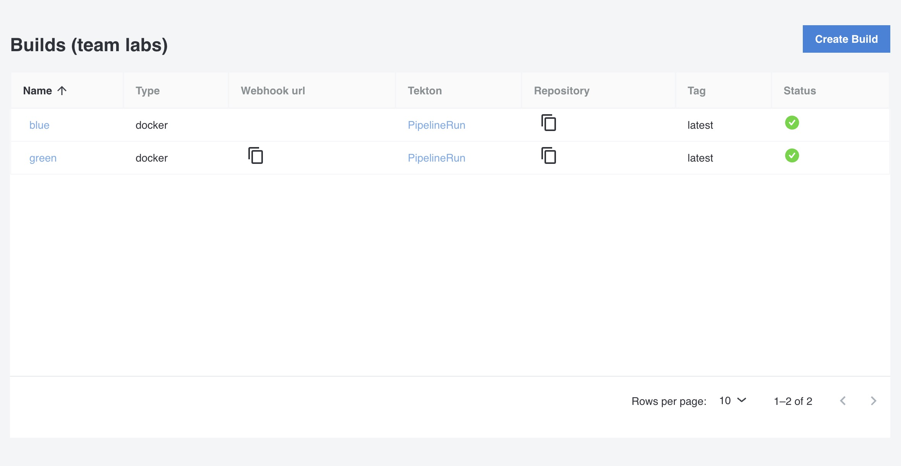

<!--  -->

A Build in Otomi is a self-service feature for building OCI compliant images based on application source code.

:::info
Ask your platform administrator to activate Harbor to use this feature.
:::

## Builds (all)

All Builds of the team are listed here.



| Property      | Description                                                     |
| ------------- | --------------------------------------------------------------- |
| Name          | The name of the build                                           |
| Type          | Type of the build. `buildpacks` or `docker`                     |
| Webhook url   | The `copy to clipboard` webhook URL if a trigger is configured for the build |
| Tekton        | Link to the `PipelineRun`` of the build in the Tekton dashboard |
| Repository    | The `copy to clipboard` repository name of the image            |
| Tag           | The tag of the image                                            |
| Status        | The status of the Build. If the Build has failed. click on the Tekton link to see more details |

## Create a build

1. Enter a name for the build

The name of the build will be used for the registry name of the image (`harbor.<domainSuffix>/team-name/build-name`)

2. (optional) Adjust the tag

The tag will be used to tag the image  (`harbor.<domainSuffix>/team-name/build-name:tag`)

Now choose the type of the build:

- Use `Docker` to build an image using the `./Dockerfile` in your code repository
- Use `Buildpacks` to build an image from application source using Buildpacks

### Docker

1. Add the URL of the repository that contains the application source code.
2. (optional) Change the path of the `Dockerfile`. Default is `./Dockerfile`. To use a Dockerfile is a specific folder, use `./folder/Dockerfile`.
3. (optional) Change the revision. This can be a commit, a tag, or a branch.
4. (Optional) Select `External Repo` if the repository used for the Build is not a public or a private Git repo in the local Gitea. When selected, fill in the secret name that contains the required SSH credentials. Read more [here](https://tekton.dev/docs/how-to-guides/clone-repository/#git-authentication) about how to setup SSH authentication with your Git provider.
5. (optional) Select to create an event listener to trigger the build based on a Gitea webhook.

### Buildpacks

1. Add the URL of the Git repository that contains the application source code
2. (optional) Add the path. This is a subpath within the repo where the source to build is located
3. (optional) Change the revision. This can be a commit, a tag, or a branch
4. (Optional) Select `External Repo` if the repository used for the Build is not a public or a private Git repo in the local Gitea. When selected, fill in the secret name that contains the required SSH credentials. Read more [here](https://tekton.dev/docs/how-to-guides/clone-repository/#git-authentication) about how to setup SSH authentication with your Git provider.
5. (optional) Select to create an event listener to trigger the build based on a Gitea webhook.

### Build status details

To see the more status details of the build, click on the `PipelineRun` link of the build in the list of builds. If a trigger is configured, the link will show all PipelineRuns.

### Configure a webhook for the Git repo in Gitea

1. In Otomi Console, click on `apps` the left menu and then open `Gitea`
2. In the top menu of Gitea, click on `Explore` and then on the `green` repo
3. Go to `Settings` (top right) and then to `Webhooks`
4. Click `Add Webhook` and select `Gitea`
5. In the `Target URL`, paste the webhook URL from your clipboard.
6. Click `Add Webhook`

### Expose the trigger listener publicly

When using an external (private) Git repository, the trigger event listener that is created by Otomi can also be exposed publicly. To expose the event listener publicly:

1. Go to Services
2. Click create new service
3. Select the `el-gitea-webhook-<build-name>` internal service
4. Under `Exposure`, select `External`
5. Click `Submit` and the `Deploy Changes`

### Restart a build

To restart a build:

- Start a shell in the console
- run the following command:

```
tkn pipelineruns list
tkn pipelinerun logs <pipelinerun-name> -f
```

Build can be restarted by changing the `tag` of the build or by restarting the pipeline manually:

- Start/open a shell in the console
- run the following command:

```
tkn pipelines list
tkn pipeline start <pipeline-name> --use-pipelinerun <pipelinerun-name>
```


