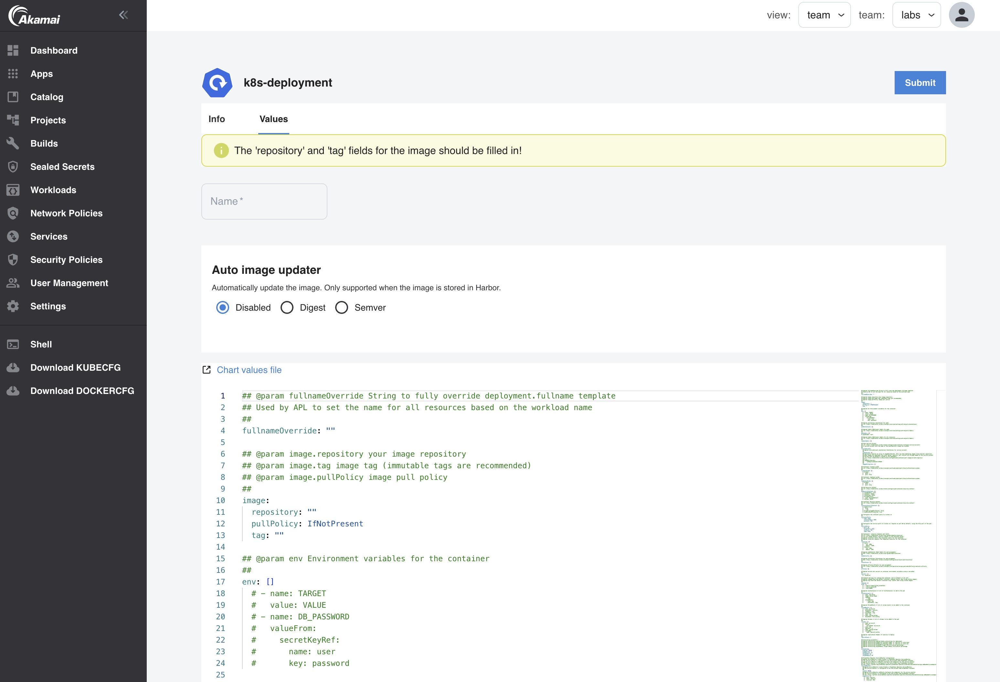

## About the Catalog quick starts

The Catalog is a library of curated Helm charts to create Kubernetes resources. By default the Catalog contains a set of Helm charts provided to get started quickly, but they can also be modified depending on your requirements or be removed from the Catalog. 

The contents of the Catalog and the RBAC configuration (which Team can use which Helm chart) are managed by the platform administrator. Contact the platform administrator if you would like to add your own charts to use within your Team.

The Catalog contains a set of Helm charts that can be used as quick starts. The following quick starts are available:

### Kubernetes Deployment

The `k8s-deployment` Helm chart can be used to create a Kubernetes `Deployment` (to deploy a single image), a `Service` and a `ServiceAccount`. Optionally a `HorizontalPodAutoscaler`, a Prometheus `ServiceMonitor` and a `Configmap` can be created.

### Kubernetes Deployment with Open Telemetry Instrumentation

The `k8s-deployment-otel` Helm chart can be used to create a Kubernetes `Deployment` (to deploy a single image), a `Service`, a `ServiceAccount` and an `Instrumentation` resource. Optionally a `HorizontalPodAutoscaler`, a Prometheus `ServiceMonitor` and a `Configmap` can be created.

### Kubernetes Canary Deployments

The `k8s-deployments-canary` Helm chart can be used to create 2 Kubernetes `Deployments` (to deploy 2 versions of an image), a `Service` and a `ServiceAccount` resource. Optionally a `HorizontalPodAutoscaler`, a Prometheus `ServiceMonitor` and a `Configmap` (for each version) can be created.

### Knative-service

The `knative-service` Helm chart can be used to create a Knative `Service` (to deploy a single image), a `Service` and a  `ServiceAccount`. Optionally a Prometheus `ServiceMonitor` can be created.

### PostgreSQL cluster

The `postgresql-cluster` Helm chart can be used to create a cloudnativepg PostgreSQL `Cluster`. Optionally a Prometheus `PodMonitor` and a `Configmap` (for adding a postgresql dashboard to Grafana) can be created.

### Redis master-replica cluster

The `redis-cluster` Helm chart can be used to create a Redis master-replica cluster.

### RabbitMQ Cluster and/or Queues

The `rabbitmq-cluster` Helm chart can be used to create a `RabbitmqCluster`, `queues` and `Policy`s

## Using the Catalog

1. Click on `Catalog` in the left menu

2. You will now see all the templates that are available to use

3. Click on the `k8s-deployment` template

In the Info tab you'll see some information about the Chart like the version and additional instructions.

3. Click on the `Values` tab

4. Continue to [create a workload](workloads.md)
