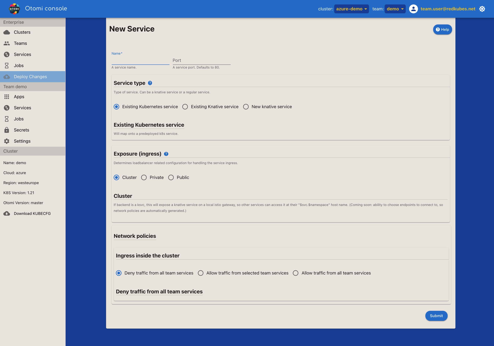

<!--  -->

A service in APL is a self-service feature for:

- Publicly exposing ClusterIP services. APL will automatically create and configure all ingress resources needed, including Istio Virtual Services and Gateways, certificates, DNS records and the Oauth2 proxy for Single Sign On.

- Configuring Traffic Control to split traffic between 2 deployments using the same service.

## Services

All Services of the team are listed here.

| Property      | Description                                            |
| ------------- | ------------------------------------------------------ |
| Service Name  | The name of the service                                |
| Ingress class | The ingress class configured. This is the ingress controller that exposes the service |
| URL           | The URL of the service if the service is configured for external exposure |
| Status        | The status of the service |

## Create a Service

First select the (ClusterIP) service to use.

## Configuring traffic control (optional)

The traffic control option allows to split traffic between multiple deployed versions of the same app (blue-green, canary). Note that the traffic control can only be used when:

- There are 2 versions deployed that share a single service.

- The service is configured for external exposure.

- Select `Enabled` to configure traffic control.

- Fill in the weight for the 2 versions. A 50/50 weight can be used for blue/green. A 90/10 weight can be used for canary.

## Configuring exposure (ingress)

Exposure controls whether internet exposure should be enabled or not. Two options exist:

- `No Exposure`: Choose to expose services in-cluster only (default).

- `External`: Choose to expose services on a private or public load balancer.

### No Exposure

Choose to expose services in-cluster only.

:::info
The `No Exposure` option is deprecated. Only use the `External` exposure option.
:::

### External

Use External to expose a service with a domain name and a certificate on an external network (using an external load balancer).

A URL will have a hostname that consists of `$HOST_NAME.$DNS_ZONE`. Options are described below.

| Setting                          | Description                                                                                                               |
| -------------------------------- | ------------------------------------------------------------------------------------------------------------------------- |
| Ingress class name               | The ingress class to assing this service to. Select one of the available classes                                          |
| TLS passthrough                  | Pass through the request as is to the backing service                                                                     |
| Use suggested domain             | The suggested domain is the team domain for which a wildcard certificate already exists. Has the team name in it          |
| Host                             | Choose a hostname that will be the prefix of the domain                                                                   |
| Forward path                     | Do not "terminate" the path but instead pass it to the receiving service                                                  |
| DNS Zone                         | Choose a dns zone that will be the suffix of the domain                                                                   |
| Authenticate with Single Sign On | Forwards any unauthenticated traffic to the Keycloak login page, which might forward to an external IDP                   |
| Already has a certificate        | Don't generate certificates for this service                                                                              |
| > Certificate ARN                | [AWS only] Provide the certificate ARN                                                                                    |
| > Select existing secret name    | [non AWS] Provide a TLS secret name previously created under `Secrets`. Override to select name of secret not known here  |
| HTTP Response Headers            | HTTP Response headers that will be set on the exposed service                                                             |

## Using a CNAME

Select `Use CNAME` when the URL of the service is used as a value in a CNAME.

### With TLS Termination at the NGINX Controller

Follow the steps below to set up a CNAME when the TLS termination happens on the NGINX controller.

1. Configure a CNAME entry with your domain name provider.

2. Generate or copy your domain certificates and store them as a TLS secret in your team's namespace.

3. Go to the service configuration section in the APL Console.

4. Create a new service by selecting the k8s service and port that you want to expose.

5. Check the "Use CNAME" checkbox. Two text boxes will appear: "domain" and "tlsSecretName".

6. Fill in both text boxes accordingly. Example: domain=`demo.example.com`, tlsSecretName=`my-cname-cert`.

7. Click on the "Submit" button, followed by the "Deploy" button.

### With TLS Termination at the Application (Pod) Level

Follow the steps below to set up a CNAME when the TLS termination happens on the application (pod) running on the cluster. It is expected that the certificates are already embedded or mounted in the application/pod.

1. Configure a CNAME entry with your domain name provider.

2. Go to the service configuration section in the APL Console.

3. Create a new service by selecting the k8s service and port that you want to expose.

3. Check the "TLS Passthrough" checkbox.

4. Check the "Use CNAME" checkbox. Fill the domain field(leave the tlsSecretName field empty).

5. Provide your cname domain in the text box.

6. Click on the "Submit" button, followed by the "Deploy" button.