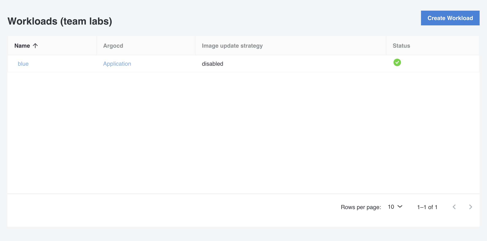

<!--  -->

A Workload in Otomi is a self-service feature for creating Kubernetes resources using Helm charts from the Otomi Developer Catalog.

## Workloads (all)

All Workloads of the team are listed here.



| Property | Description                                       |
| -------- | ------------------------------------------------- |
| Name     | The name of the workload                          |
| Argocd   | Link to the Argo CD application in the Argo CD UI |
| Image update strategy | The configured update strategy for the workload |
| Status | The status of the workload. Click on the Argo CD application link to see more status details |

## Create a Workload

Before creating a workload from the developer catalog, we'll need the `repository` and `tag` of the image you would like to use.

1. Go to the list of Builds and add the `repository` of the build to use to your clipboard. Remember the tag.

2. Go to `Workloads` in the left menu and click on `Create Workload`

3. Select a template from the catalog to use

4. Add a `Name` for the workload

5. (Optional) Configure the `Auto image updater`. Default is `Disabled`.

The Auto Image Updater will (based on the update strategy) automatically update the container images of a workload.

Select the update strategy. Choose between:

- Digest: Inspects a single tag in the registry for changes, and updates the image on any change to the previous state. Requires to provide a `repository` and a `tag`.
- Semver: Update based on semantic versions. Example: `v1.0` would allow the image to be updated to any patch version within the 1.0 minor release.

There are 2 other properties available: `imageParameter` and `tagParameter`. Change the parameters in case your Helm application contains more than one image in the manifests or uses another parameters to define which image to render in the manifests.

6. In the workload `values`, change the following parameters:

```yaml
image:
  repository: <paste from clipboard>
  tag: latest
```

6. Click `Submit`

Now click on `Deploy Changes`

After a few minutes, Otomi will have created all the needed Argo CD resources to deploy your workload. In the workloads list, click on the `Application` link of your workload to see the status of your workload.

The values of a workload can be changed at any time. Changes will automatically be deployed.
