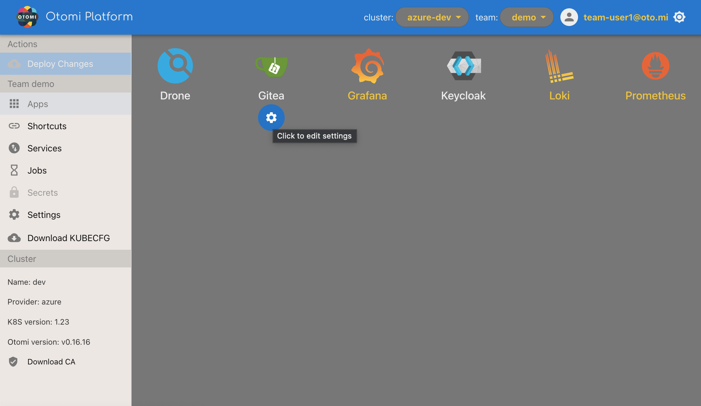

Welcome to Otomi! If you are a developer and are going to use Otomi, this getting started guide is for you. In this first part we are going to make sure everything is ready to get started.

We assume the platform administrator has:

1. Activated the following applications:

- Harbor
- ArgoCD
- Prometheus
- Loki
- Grafana
- Trivy Operator
- Gatekeeper (with option `Disable validating webhook` set to true)

For the [Use OpenTelemery](lab-27) Lab, the Tempo app needs to be enabled together with tracing at `Istio` and `Nginx Ingress` apps.

1. Created a team called `demo`
2. [Created an account](/docs/apps/keycloak#create-a-user-in-keycloak) and added your user the team group in Keycloak
3. Provided you with the following information:

- The URL to access the Otomi web UI (Otomi Console)
- Your login credentials

When you have received the URL of the web UI and have a username/password, then it's time to sign-in

## Sign in to the Console

- Go to the provided URL. The URL will look like this: https://otomi.yourdomain.com
- Sign in with the provided username/password or your existing corporate AD account

After sign in, you will see this page:

