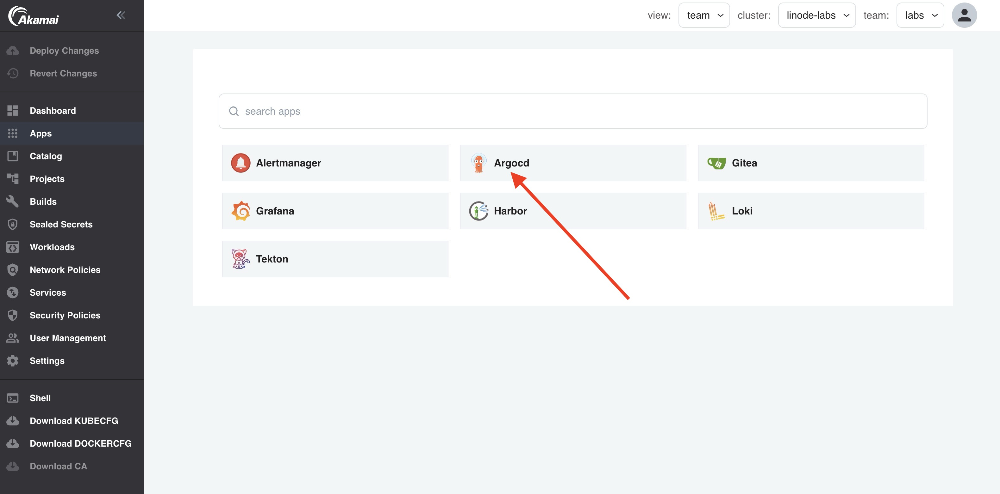
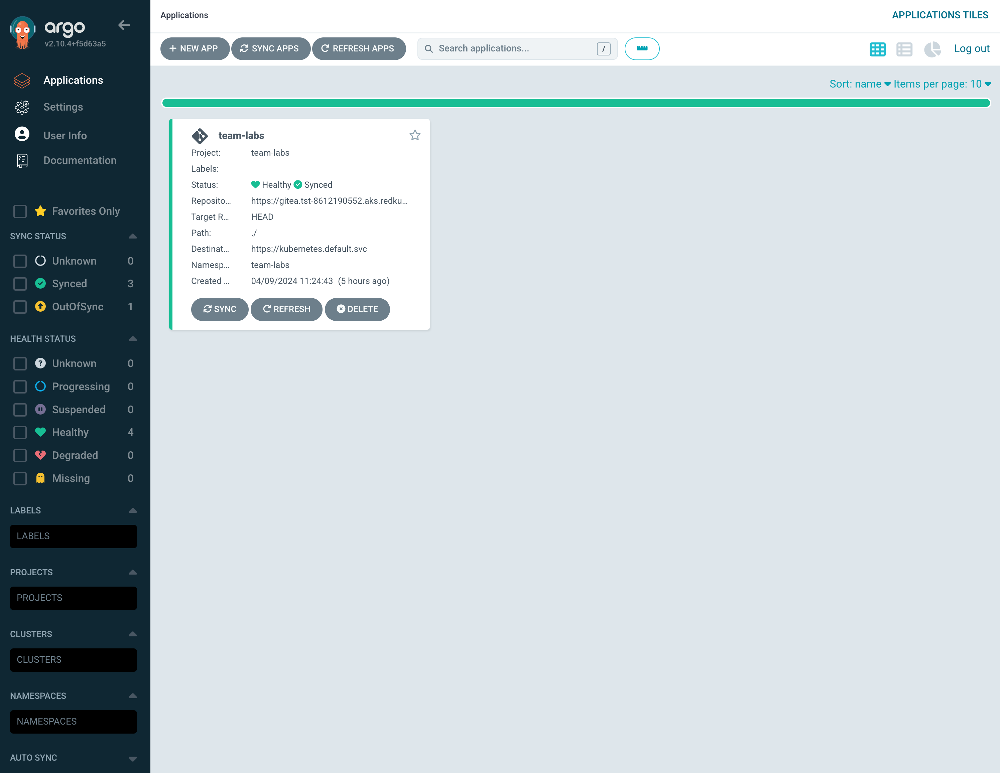
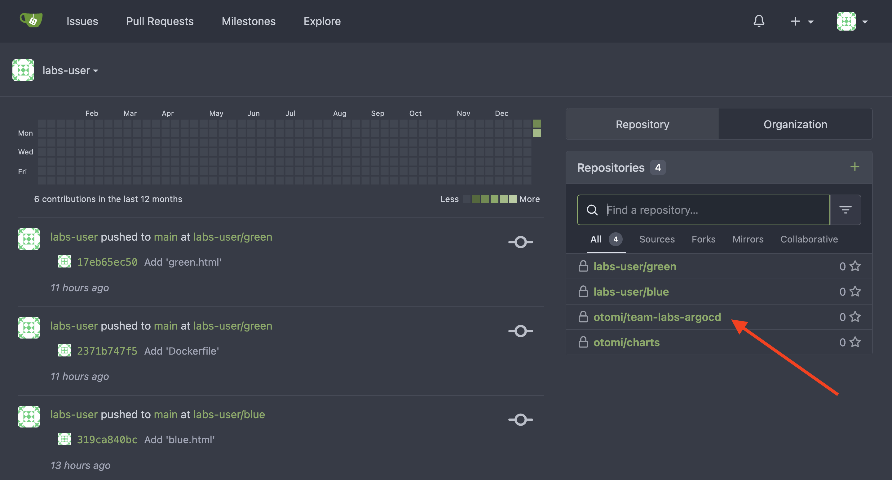
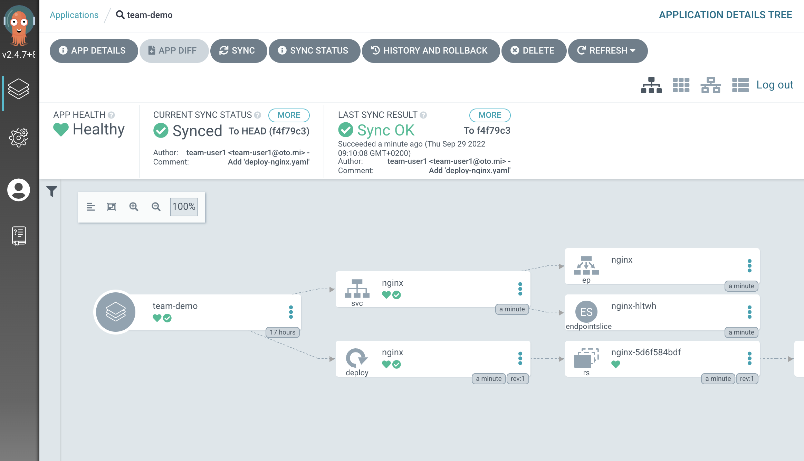

:::info
**Prerequisite**: Argo CD needs to be activated for this lab.
:::

Deploying applications using `kubectl apply -f` can be inefficient. As a developer, managing resources based on code stored in Git enhances control and traceability. Otomi integrates with Argo CD to provide a seamless GitOps experience, streamlining your deployment process.

## Deploying Workloads Using Argo CD and Otomi

Start by navigating to the apps section in the Otomi console, where you will find an app named Argo CD. Click on it to proceed.



In Argo CD, notice that an application specific to your team has already been set up. This application syncs with any manifest present in the Gitea repository designated for Argo.



After clicking on the app and selecting `APP DETAILS`, you'll find the `REPO URL`. The `SYNC POLICY` is also set to `ENABLE AUTO-SYNC`, facilitating automatic synchronization with the repository.

Returning to the Otomi console, select the Gitea app in the apps section. There, you'll discover a new repository titled `otomi/team-<name>-argocd`.



### Demonstrating the Power of Argo CD

Let's demonstrate the capabilities of Argo CD by adding a manifest to the repository:

1. Create a file named `deploy-nginx.yaml` in the repository.
2. Insert the following contents into the file:

   ```yaml
   apiVersion: apps/v1
   kind: Deployment
   metadata:
     name: nginx
     labels:
       otomi.io/app: nginx
       app: nginx
   spec:
     replicas: 1
     selector:
       matchLabels:
         app: nginx
     template:
       metadata:
         labels:
           app: nginx
       spec:
         containers:
           - name: nginx
             image: nginxinc/nginx-unprivileged:stable
             resources:
               limits:
                 memory: '128Mi'
                 cpu: '200m'
               requests:
                 memory: '64Mi'
                 cpu: '100m'
             ports:
               - containerPort: 8080
   ---
   apiVersion: v1
   kind: Service
   metadata:
     name: nginx
   spec:
     selector:
       app: nginx
     ports:
       - port: 80
         targetPort: 8080
   ```

3. Commit the changes to the repository.

Once you return to the Argo CD application, click on the `team<name>` application.

Remember, the application is not configured for automatic syncing, so manually initiate a `SYNC` by selecting SYNC and then `REFRESH`.




