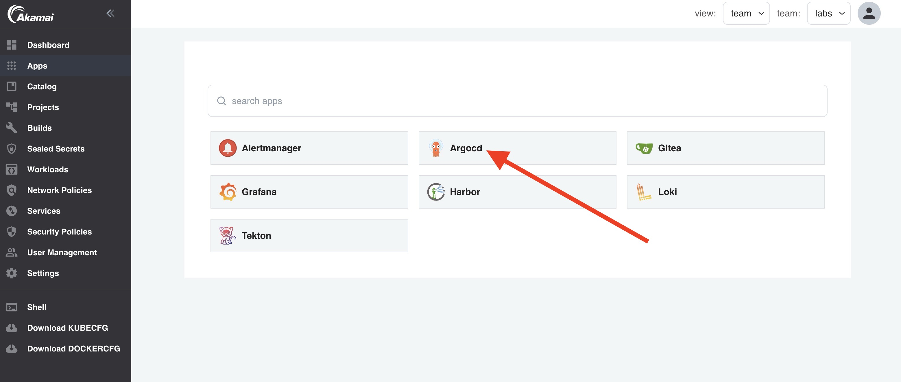
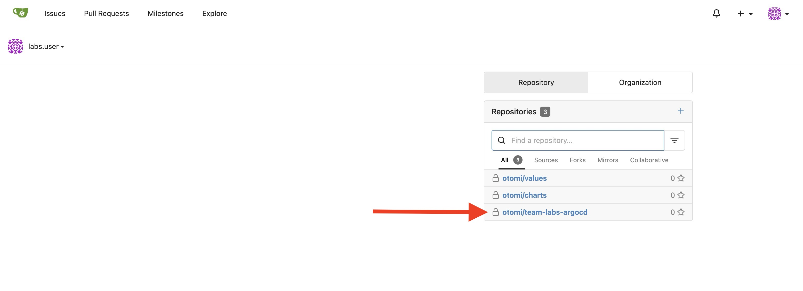
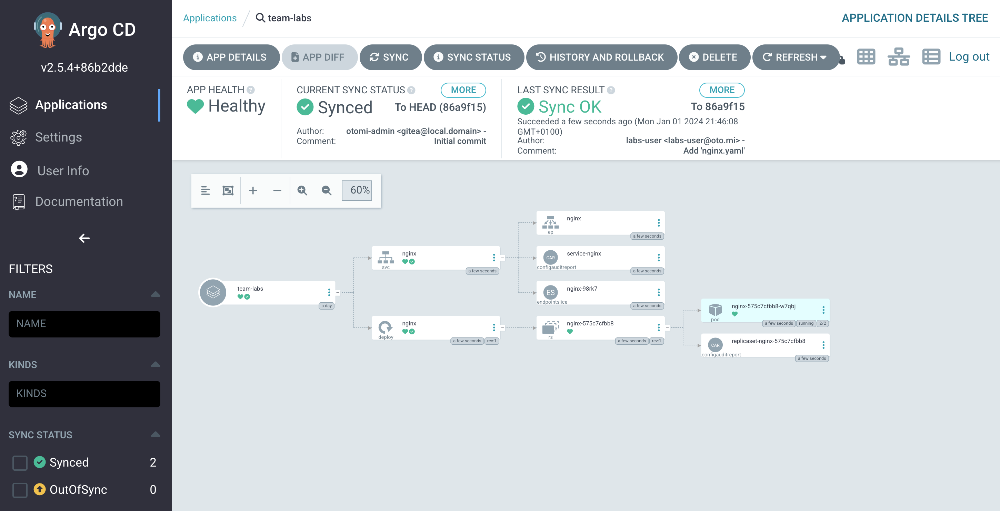

:::info
Prerequisite: For this lab, Argo CD needs to be activated.
:::

Deploying your applications by doing `kubectl apply -f` is not ideal. You as a developer would like to automatically deploy and update your application after a new build. Otomi integrated Argo CD to provide an out-of-the-box gitops solution.

## Using ArgoCD to deploy manifests and charts

In the apps section in Otomi console, you'll see an app called Argo CD. Click on it.



In Argo CD you'll see that an Argo app has already been created for your team. This app is configured to synchronize any manifest that is in the created repo in Gitea for Argo.


If you click on the app and then click on `APP DETAILS`, you'll see the `REPO URL` and also that the `SYNC POLICY` is set to `ENABLE AUTO-SYNC`.

Go back to the console and click on the Gitea app in the apps section. In the list of repo's you'll now see a new repo called `otomi/team-<name>-argocd`.



To show the power of Argo CD, let's add a manifest to the repo and see what happens.

- Create a new file in the repo called `deploy-nginx.yaml` 
- Add the following contents to the file:

```
apiVersion: apps/v1
kind: Deployment
metadata:
  name: nginx
spec:
  replicas: 1
  selector:
    matchLabels:
      app: nginx
  template:
    metadata:
      annotations:
        policy.otomi.io/ignore-sidecar: container-limits,psp-allowed-users
      labels:
        app: nginx
    spec:
      containers:
        - name: nginx
          image: nginxinc/nginx-unprivileged:stable
          resources:
            limits:
              memory: '128Mi'
              cpu: '200m'
            requests:
              memory: '64Mi'
              cpu: '100m'
          securityContext:
            runAsUser: 1001
          ports:
            - containerPort: 8080
---
apiVersion: v1
kind: Service
metadata:
  name: nginx
spec:
  selector:
    app: nginx
  ports:
    - port: 80
      targetPort: 8080
```

- Commit Changes

Now go back to the Argo CD application and click on the `team<name>` application. You can see that all the Kubernetes resources have been created.




