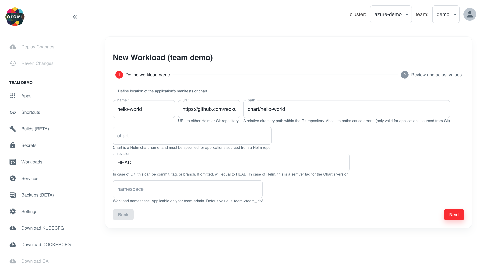

Otomi offers a self-service feature to create 3 types of workloads:

- Regular application: will use the [Otomi deployment Helm chart](https://github.com/redkubes/otomi-charts)
- Function as a Service: will use the [Otomi Knative service Helm chart](https://github.com/redkubes/otomi-charts)
- Bring your own Helm chart: use your own (custom) Helm chart

In this Lab you're going to create a workload in Otomi to install your're own Helm chart and we'll be using the Otomi demo Hello World Nodejs Helm chart.

## Creating a Workload to install your Helm chart

- Click on `Workloads` in the left menu.
- Click on `Create Workload`

- Select `Bring your own Helm chart`

- Enter the following name for the workload

`hello-world`

- Enter the URL to the Git repo containing the Helm chart or a Helm repository

`https://github.com/redkubes/nodejs-helloworld`

- Add the Path of the chart within the repo:

`chart/hello-world`

- Click `Next`
- We are going to use the default chart values, so there is no need to fill in any values here
- Click `Submit`

The values of a workload can be changed at any time. Changes will automatically be deployed.