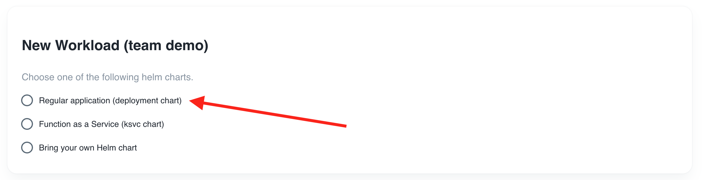

In the previous 2 parts we have explained how to deploy a workload with a BYO manifest using Kubectl and how to deploy a workload with a BYO manifest using ArgoCD in Otomi. In this part we'll deploy a regular workload (a Kubernetes Deployment) using the Otomi Workloads feature.

When creating workloads in Otomi, the specifications (URL and path) and the values of a Helm chart is stored in `otomi-values` and then used to automatically create the ArgoCD resources to deploy the workload.

As a developer, you'll have the following options to deploy serverless workloads:

- BYO Knative service manifest and deploy it using kubectl or ArgoCD
- Create workloads with the deployment Helm chart  in `otomi-charts`
- Create workloads with the Knative Helm chart in `otomi-charts`

## Creating a Regular Workload

You can create a workload to deploy your own Helm chart, or you can use one of the `otomi-charts` Helm charts. In this case we'll use the deployment chart in the `otomi-charts` repository.

1. Go to `Workloads` in the right menu and click on `New Workload`

2. Choose `Regular application`



3. Enter a name for the workload

```
hello-deploy
```

4. Fill in the image to deploy:

```
otomi/nodejs-helloworld
```

5. Fill in the tag of the image to deploy:

```
v1.2.13
```


6. Click `Next`

7. Review the values. Here you can add more values supported by the [otomi-charts](https://github.com/redkubes/otomi-charts)


8. Click `Submit`

Now click on `Deploy Changes`

After a few minutes, Otomi will have created all the needed ArgoCD resources to deploy your workload. In the workloads list, click on the `Application` link of your workload to see the status of your workload.

The values of a workload can be changed at any time. Changes will automatically be deployed.