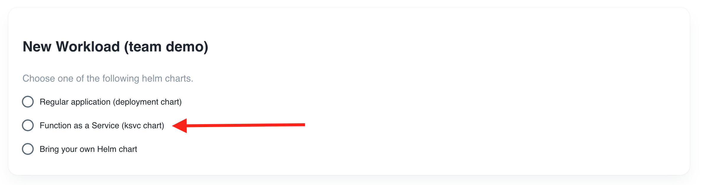
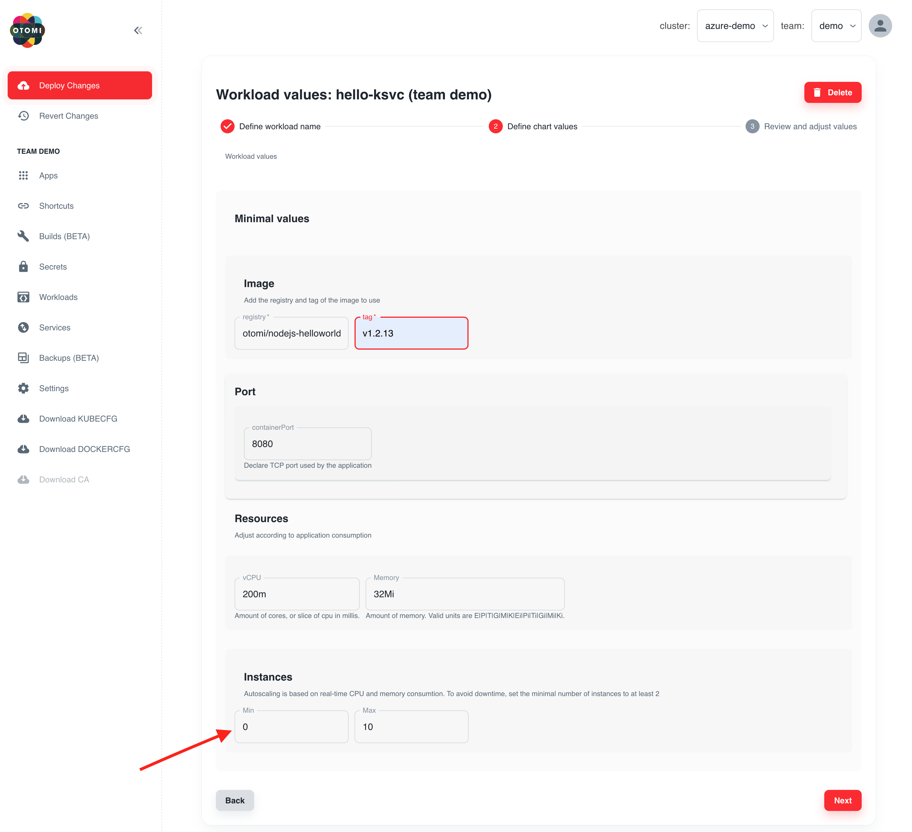

:::info
Prerequisite: For this lab, Argo CD needs to be activated.
:::

Otomi uses Knative serving for serverless (or Function as a Service) support.

As a developer, you'll have the following options to deploy serverless workloads:

- BYO Knative service manifest and deploy it using kubectl or ArgoCD
- Create workloads with the deployment Helm chart  in `otomi-charts`
- Create workloads with the Knative Helm chart in `otomi-charts`

In this lab we're going to create a workload in Otomi to create a Knative service using the knative chart in `otomi-charts`.

## Create a Function as a Service workload

You can create a workload to deploy your own Helm chart, or you can use one of the `otomi-charts` Helm charts. In this case we'll use the deployment chart in the `otomi-charts` repository.

1. Go to `Workloads` in the right menu and click on `New Workload`

2. Choose `Function as a Service`



3. Enter a name for the workload

```
hello-ksvc
```

4. Fill in the image to deploy:

```
otomi/nodejs-helloworld
```

5. Fill in the tag of the image to deploy:

```
v1.2.13
```



:::info
Note: When creating a Function as a Service workload, the Min Instances will by default be set to `0` to enable `Scale to Zero`.
:::

6. Click `Next`

7. Review the values. Here you can add more values supported by the [otomi-charts](https://github.com/redkubes/otomi-charts)


8. Click `Submit`

Now click on `Deploy Changes`

After a few minutes, Otomi will have created all the needed Argo CD resources to deploy your workload. In the workloads list, click on the `Application` link of your workload to see the status of your workload.

The values of a workload can be changed at any time. Changes will automatically be deployed.

## (optionally) Publicly expose the service

- In the left menu panel under click `Services` then click on `Create Service`

- Select the name of the (existing) knative service: `hello-ksvc`

- Under `Exposure Ingress`, select `Ingress` and use the default configuration

- Click on `Submit`
  
- Click on `Deploy Changes` (the Deploy Changes button in the left panel will light-up after you click on submit).


