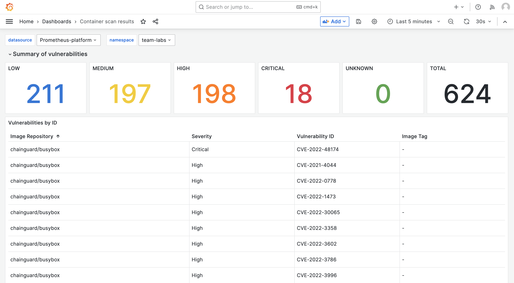

:::info
Trivy need to be activated for this lab.
:::

So now you know how to scan container images when pushed to Harbor. But what if you have long running versions of containers? When new vulnerabilities are identified after you scanned the image, you wil only see them when you update your image. For this scenario, Otomi offers Trivy Operator for automatic daily scanning of containers in all Teams.

## See Trivy scan results

When Trivy is enabled by the platform admin and Otomi runs in multi-tenant mode, then each team will see the Trivy scan results for all containers deployed within the Team, in a Trivy dashboard in Grafana.

- In the right menu, click on `apps`
- Click on `Grafana`
- Open the Trivy scan results dashboard

In the dashboard you can see all identified vulnerabilities per container:

