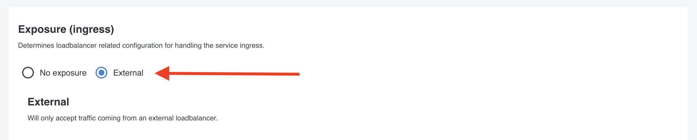

When you have deployed your app, you will propably like to expose it publicly. You propably noticed that in the previous part, we created a Kubernetes service of type `ClusterIP` and not `LoadBalancer` and also that the Pod(s) created by the deployment have an Istio sidecar. All Pods created in your team will automatically be added to the service mesh. In this part we'll create a Service in Otomi to expose your app publicly. When you create a Service, Otomi will then create the Istio virtual service and configure ingress for your application.

## Create a Service

- In the left menu panel under click `Services` then click on `Create Service`

- Select a service that you already deployed:

- Under `Exposure Ingress`, select `Ingress` and use the default configuration

- Click on `Submit`
- Click on `Deploy Changes` (the Deploy Changes button in the left panel will light-up after you click on submit).

Deploying changes in Otomi usually takes just a couple of minutes depending on the amount of resources available on your cluster. You will see your service in the list of Services. Click on the URL and see your application.