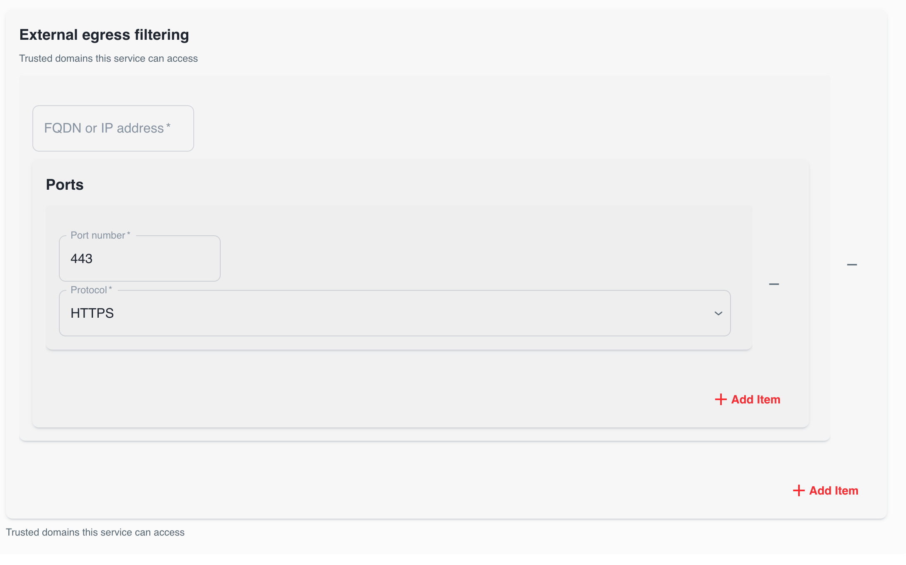

In some cases you want to explicitly allow access to your application. This can be done by creating network policies. Otomi supports 2 types of network policies:

- Policies for ingress traffic inside the cluster
- Policies for egress traffic to go outside of the cluster (to access external FQDNs)

## Prerequisites

Before you can configure network policies, first make sure to add the  `otomi.io/app: <service name>` label to all pods belonging to the service.

## configuring network policies for internal ingress

The internal ingress network policies alllow you to:

- Deny all traffic to your application
- Allow selected applications running on the cluster to access your application

`Deny all` and `Allow all` we don't need to explain right?

To allow other applications running on the cluster to access your application, do the following:

- Register the Kubernetes ClusterIP service of your app as a Service in Otomi. If no public ingress is required, then just use the `Cluster` ingress option

- In the `Ingress traffic inside the cluster` block in the `Network policies` section of the Service, select `Allow selected`
- Add the team name and the service name (a service also registered in Otomi)

In the example below, you are part of the team backend and you would like to allow the service frontend running in team frontend to be able to access your service:

- Click `Submit` and then `Deploy Changes`

## Configuring network policies for external egress

The external egress policies allow you to:

- Allow your application to access resources outside of the cluster

By default this is not allowed.

To allow your application to access resources outside of the cluster, do the following:

- In the `External egress filtering` block in the `Network policies` section of the Service, click on `Add item`
- Add the Fully Qualified Domain Name (FQDN) or the IP address of the resource your application needs to access
- Add the port number
- Select the protocol

- Click `Submit` and then `Deploy Changes`

