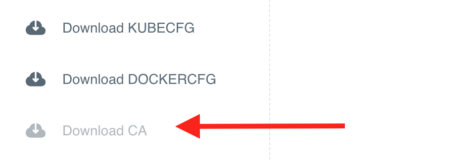

When you have received the URL of the web UI of Otomi Platform and have a username/password with access permissions, then it's time to sign-in

## Sign in

- Go to the provided URL. The URL will look like this: https://otomi.yourdomain.com
- Sign in with the provided username/password or your existing corporate AD account

After sign in, you will see this page:


## (Optional) Download CA

In some cases the platform is using a non-trusted CA. In this case you can download the CA and add it to your keychain.

- In the left menu of the console, click on "Download CA"



- Double click the downloaded CA.crt or add the CA to your keychain on Mac using the following command:

```bash
sudo security add-trusted-cert -d -r trustRoot -k /Library/Keychains/System.keychain ~/Downloads/ca.crt
```

On Windows, use PowerShell (running as Administrator) with the Certutil:

```powershell
certutil.exe -addstore root <downloaded cert path>
```

Or:

```powershell
Import-Certificate -FilePath "<downloaded cert path>" -CertStoreLocation Cert:\LocalMachine\Root
# Restart the browser
```

But you could also run Chrome in insecure mode:

```bash
alias chrome-insecure='/Applications/Google\ Chrome.app/Contents/MacOS/Google\ Chrome --ignore-certificate-errors --ignore-urlfetcher-cert-requests &> /dev/null'
```