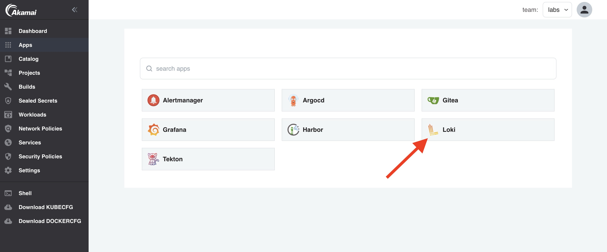
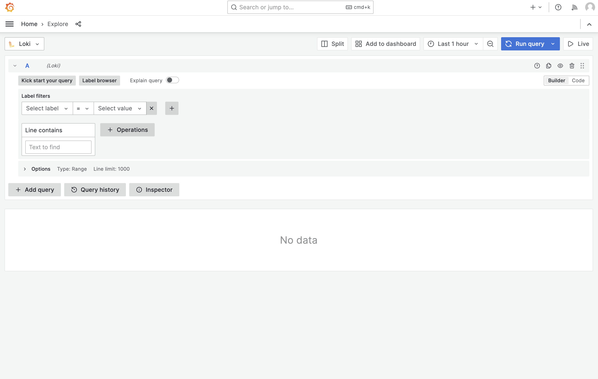

:::info
Loki, Minio, Prometheus and Grafana need to be activated for this lab.
:::

When your application is deployed, you would of course like to be able to see container logs for debugging purposes. Grafana Loki is used in Otomi for log aggregation. When Grafana Loki is enabled, you'll see the Loki app in your apps.

:::info
Only when Otomi is configured in multi-tenant mode, container logs of teams are split up between teams. This means you can only see the logs of your own team. If multi-tenancy is not enabled, you can see the logs of all containers running on the cluster. If you don't want other teams to see your logs, ask the administrator to enable the Otomi multi-tenancy feature.
:::

## View container logs

- Open the Loki app in your team apps

In Grafana, you are directed to the `Explore` section. Otomi already added a query for you, showing the logs of all containers running in your team namespace.

Select the label `app` and then select `blue`. You will now see all the `blue` container logs. You can also create your own queries. Learn more about LogQL [here](https://grafana.com/docs/loki/latest/logql/).

## Creating shortcuts

When you created a custom query that you would like to use more often, or would like to share with the team, you can create a shortcut in Otomi.

- Copy the absolute path of your query
- In the apps section, click on the `Settings` icon of the Loki app
- Click on the `Shortcuts` tab
- Click `edit`
- Click on `Edd item`
- Fill in the `Title`, `Description` and the `Path` for the shortcut

- Click `submit` and then click `Deploy Changes`

Now click on the Shortcuts item in the left menu. Your shortcut is now available for everyone in the team to use.

