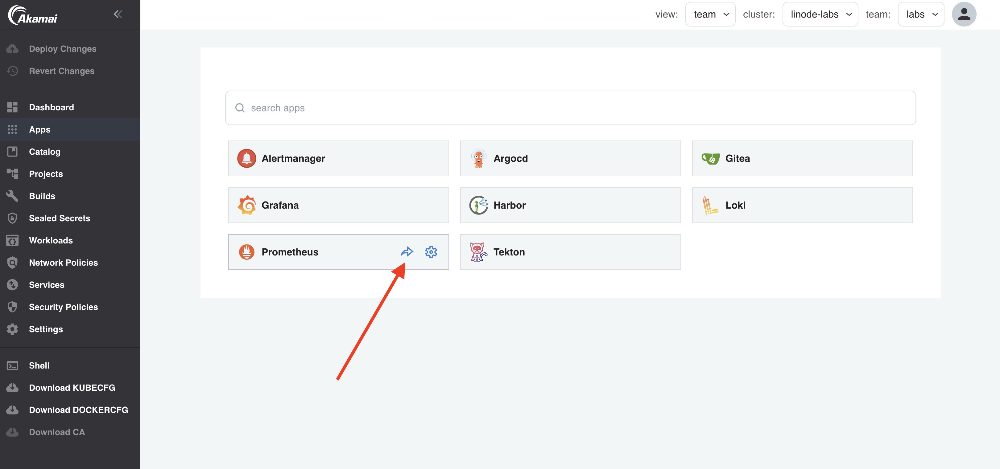
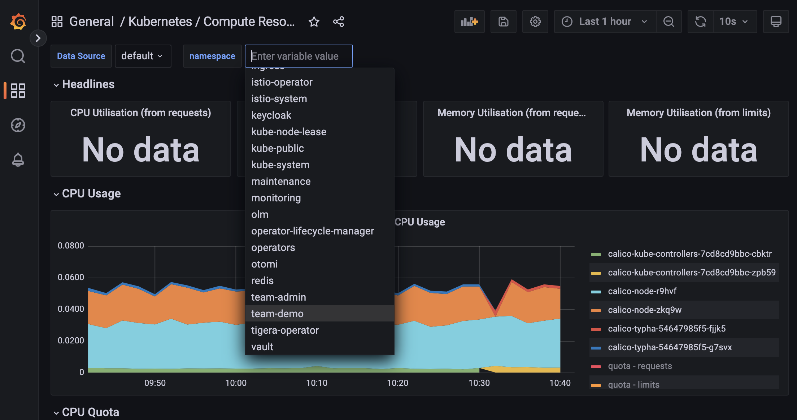
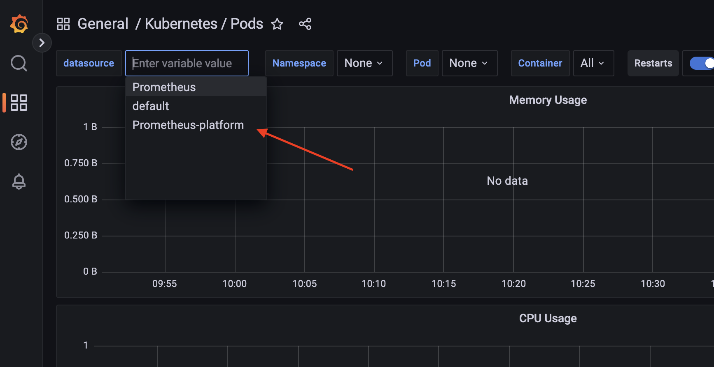

When your application is deployed, you would of course like to be able to see container metrics for debugging purposes. Prometheus is used in Otomi for metrics. When Prometheus is enabled, you'll see the Prometheus app in your apps.

:::info
When Otomi is configured in multi-tenant mode, each team will get a dedicated Prometheus and Grafana instance. Container metrics are provided by the platform Prometheus and you can use the dedicated team Prometheus to collect custom application metrics.
:::

## View container metrics (no multi-tenancy)

- Open the Grafana app in your team apps

- Grafana will open the default Welcome to Grafana page. On the right, click on `Dashboards`

Here you will see a long list of dashboards that are added by Otomi. 

- Select the `Kubernetes / Compute Resources / Namespace (Pods)` dashboard

- Select your team namespace

## View container metrics (in multi-tenancy mode)

When Otomi runs in multi-tenant mode, using Grafana for Prometheus is a little different. If you go to the dashboards, you'll only see 2 dashboards:

1. Kubernetes / deployment
2. Kubernetes / Pods

- Click on the Kubernetes / Pods dashboard. 
  
Note that you will not see any data. This is because the dedicated team Prometheus is used as a datasource, but the team Prometheus instance does not collect container metrics.

- Select the `Prometheus-platform` data source

Now you will see metrics of containers running in your team namespace.