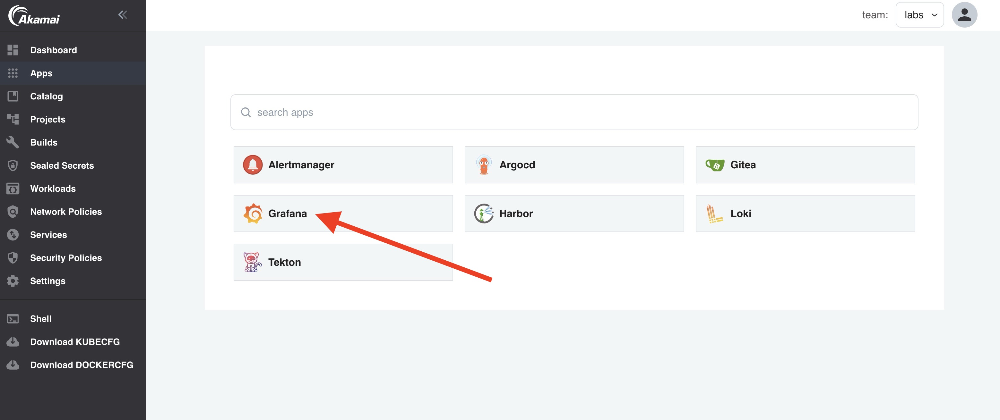

:::info
Prometheus and Grafana for the Team need to be activated for this lab.
:::

When your application is deployed, you would of course like to be able to see container metrics for debugging purposes. Prometheus is used in Otomi for metrics. When Prometheus is enabled, you'll see the Prometheus app in your apps.

:::info
When Grafana, Prometheus and Alertmanger are enabled for the Team, the team will get it's own instance of Grafana, Prometheus and/or Alertmanager. Container metrics are provided by the platform Prometheus and you can use the Team's Prometheus to collect custom application metrics.
:::

## View dashboards

- Open the Grafana app in your team apps

- Grafana will open the Dashboards page:

The dashboards are dynamically added based on the enabled platform capabilities:

| Dashboard | When added |
| --------- | ---------- |
| Kubernetes / Deployment | When Prometheus on platform level is enabled |
| Kubernetes / Pods       | When Prometheus on platform level is enabled |
| Team status             | When Prometheus on platform level is enabled |
| Container scan results  | When Trivy on platform level is enabled |
| Policy violations       | When Gatekeeper on platform level is enabled |
| Detected threads in containers | When Falco on platform level is enabled |

## View container metrics

- Click on the `Kubernetes / Pods` dashboard
- Select the required Pod and Container 
