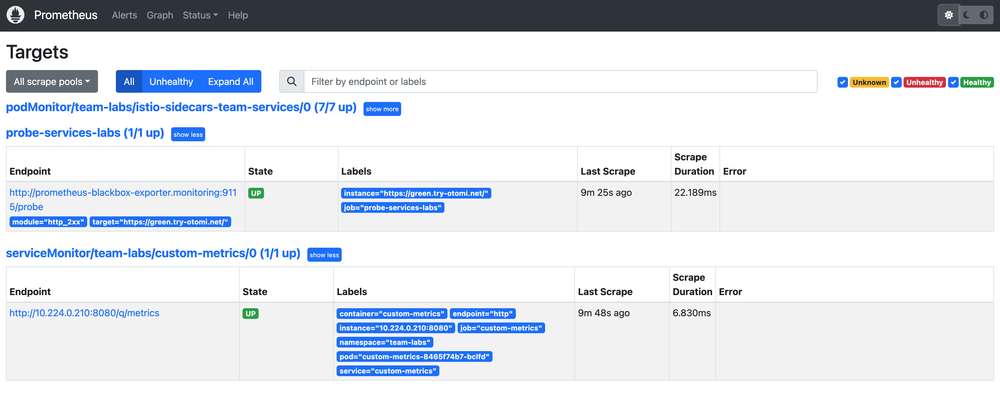
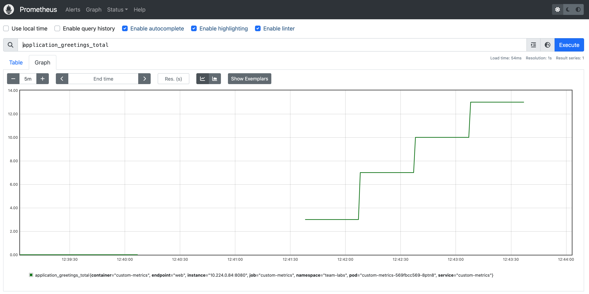

## What are custom metrics

Prometheus will collect all kind of standard container metrics like CPU and memory usage, but no (custom) business or customer metrics like the number of customers who logged into your app each hour.

To be able to collect custom metrics you will need to expose this data in your code. This is called instrumentation of code and can include annotating the code with metadata, or adding in logic to calculate and expose data.

Instrumenting code means you write code to expose information about the technical, business, and customer context. This information can then be collected and analyzed using Prometheus and Grafana.

In this guide we will not dive into the way how to instrument your code. We will assume you have a container that exposes custom metrics and will show how the custom metrics can be collected and analysed.


## Create a Workload

1. Go to the Catalog and click on the `k8s-deployment` template

2. Click on the `Values` tab

3. Fill in the name `custom-metrics`

4. Use the following values:

```yaml
image:
  repository: quay.io/rbaumgar/monitor-demo-app-jvm
  pullPolicy: IfNotPresent
  tag: latest
containerPorts:
  - name: web
    containerPort: 8080
    protocol: TCP
servicePorts:
  - port: 8080
    targetPort: 8080
    protocol: TCP
    name: web
resources:
  limits:
    cpu: 300m
    memory: 128Mi
  requests:
    cpu: 100m
    memory: 32Mi
replicaCount: 1
serviceMonitor:
  create: true
  endpoints:
    - interval: 30s
      port: web
      scheme: http
      path: /q/metrics
```

5. Click `Submit` and then `Deploy Changes`

## Check the status of the ServiceMonitor

Check if the ServiveMonitor is now being scraped by Prometheus:

1. In the left menu go to `Apps`

2. Click on the `Prometheus` app

3. In Prometheus, click on `Status` in the top menu and then click `Targets`

4. You will now see that the ServiceMonitor has the `State` UP:



Okay, our custom metrics are now being scraped by the Team's own Prometheus. Before we continue, let's first generate some load so we can see actual metrics;

1. Go to the [Expose services](lab-18) lab and expose the `custom-metrics` service

2. Run the following command in your terminal:

```bash
for i in {1..1000}; do curl https://custom-metrics-labs.<your-domain>/hello; sleep 10; done
```

3. Wait for approximately 10 minutes

## See the custom metrics

To see the custom metrics:

1. Open the `Prometheus` app

2. In Prometheus, fill in the following Expression: `application_greetings_total`

3. Click on `Graph`

4. You should now see the following:




## Next steps

Prometheus is now scraping our custom metrics. You can now use these metrics to:

- Create a dashboard in Grafana in the lab [Create custom dashboards](lab-30)
- Create rules and send alerts in the lab [Create custom rules](lab-31)

## Things to be aware of

In this lab we are using the `k8s-deployment` template. In this template the follow `label` is added:

```yaml
otomi.io/team: team-labs
```

This label is needed for the team's Prometheus to use the `ServiceMonitor` because of strict networkpolicies. If you would like to create you're own ServiceMonitors, them always add the `otomi.io/team` label to your pods!