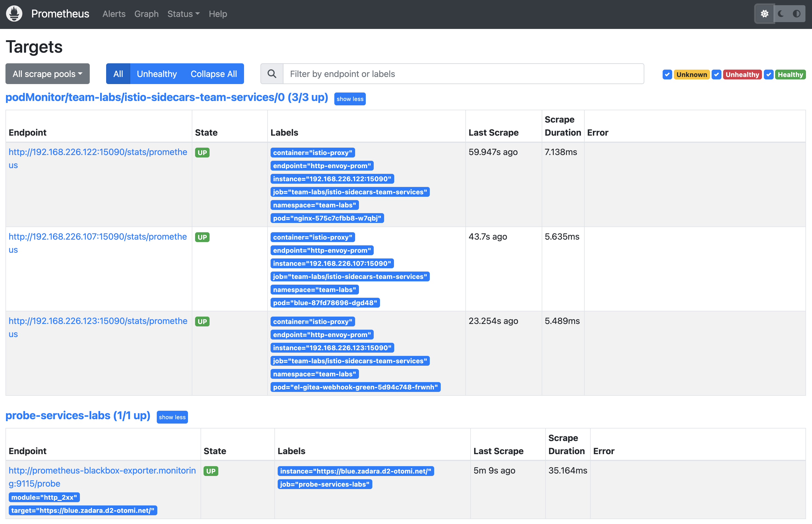
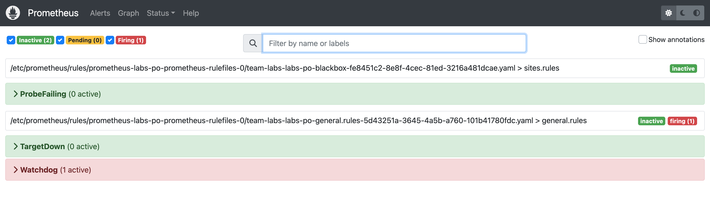

When your application is deployed, you would of course like to get an alert when you application (service) is not available anymore. To automatically monitor you applications for availability, Otomi automatically configures a prope to monitor your service.

## Monitor your application for availability

1. [Create a Service](lab-18) for your app in Otomi and publicy expose the service
2. Open the Prometheus

3. In Prometheus, Go to `Status` and click on `Targets`

In the list of targets you will see:

- The `PodMonitor` endpoints of the `istio sidecars` os the Team Workloads
- The `Probes` of all the Team services that are exposed

4. In Prometheus, Go to `Alerts`

In the alerts you will see an (inactive) alert for `ProbeFailing`. If the `State` of a Servive Probe is `Down` the Prometheus `Rule` for this alert will fire. When alertmanager is enabled, and an alert notification receiver is configured, you will automatically receive an alert when your exposed Service is down.