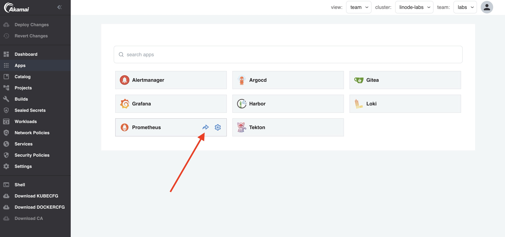

When your application is deployed, you would of course like to get an alert when you application (service) is not available anymore. To automatically monitor you applications for availability, Otomi automatically configures a prope to monitor your service.

## Monitor your application for availability

- [Create a Service](lab-7.md) for your app in Otomi. The service can have an Exposure ingress of type `Cluster` or `Ingress`

- Open the Prometheus

- In Prometheus, Go to `Status` and click on `Targets`

You will see the `prope-service-<team-name>` endpoint. First in an `UNKNOWN` state:

But after a couple of minutes the state will be `UP`:

When alertmanager is enabled, and an alert notification receiver is configured, you will automatically receive an alert when your service is down.