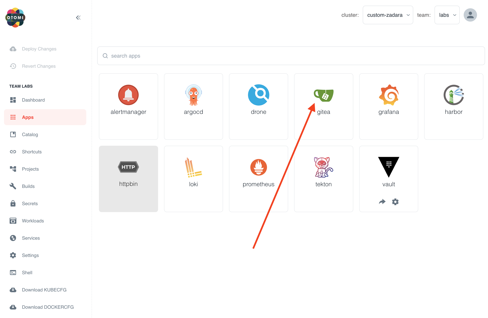
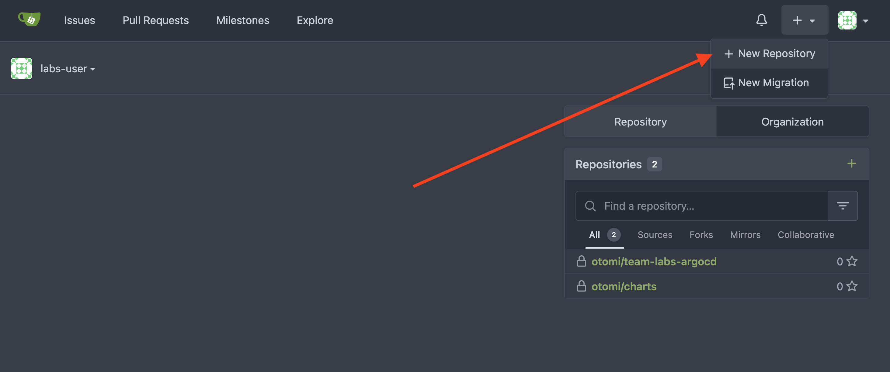
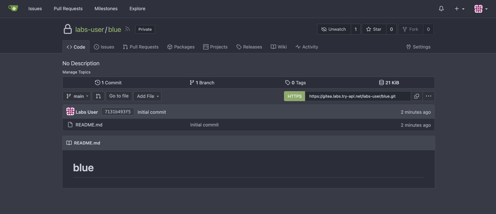

As a developer you'll need a Git repository for your code. Most organizations will probably have a central code repository like Gitlab, or use Github. But if you don't, Otomi has you covered. Otomi includes a complete self-hosted Git solution called Gitea.

As a team member, you can create and manage your own repositories.

:::info
Otomi does not create a group in Gitea that contains all the team members. Team members first have to sign in to Gitea (using OpenID), after which they are automatically added to the correct team.
:::

:::info
The `otomi-admin` account is unable to login with OpenID, this account needs to login with the normal login form.
:::

## Create a private repository

In the apps section in Otomi console, you'll see an app called Gitea. Click on it.



Now follow these steps:

- Click on `Sign In` with OpenID


- Click on `+ New Repository`



- Fill in a Repository Name
- Optional: Enable `Initialize Repository`
- Optional: Make Repository Private
- Click on `Create Repository`

Your repo is now ready to be used!



## Create 2 repositories for the labs

For the next labs we're going to need two repo's. Create the following 2 repo's:

- `blue`
- `green`

And add the following 2 files to each repo. Make sure to change `blue` to `green` in the `green` repo:

Add `Dockerfile`:

```Dockerfile
FROM nginxinc/nginx-unprivileged:stable
COPY blue.html /usr/share/nginx/html/index.html # change to green.html in the green repo!
EXPOSE 8080
```

Add `blue.html`:

```html
<!DOCTYPE html>
<html>
<head>
  <meta charset="utf-8">
  <title>Sample Deployment</title>
  <style>
    body {
      color: #ffffff;
      background-color: blue; # change to green in the green repo!
      font-family: Arial, sans-serif;
      font-size: 14px;
    }
    
    h1 {
      font-size: 500%;
      font-weight: normal;
      margin-bottom: 0;
    }
    
    h2 {
      font-size: 200%;
      font-weight: normal;
      margin-bottom: 0;
    }
  </style>
</head>
<body>
  <div align="center">
    <h1>Welcome to Blue</h1> # change to green in the green repo!
  </div>
</body>
</html>
```
