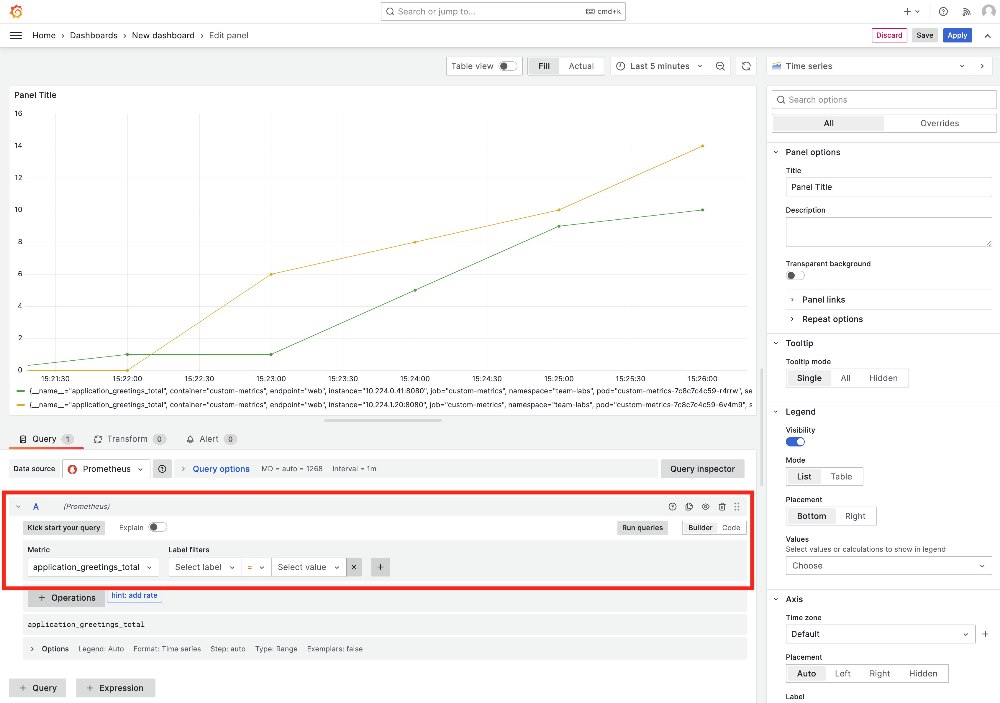

In the lab [Using custom metrics](lab-22) we created a Workload with a ServiceMonitor so the Team's Prometheus can scrape our custom metrics. In this lab we are going to create a custom Grafana dashboard and add the dashboard to a Configmap so the Team's Grafana will automatically load the dashboard.

## Create a dashboard in Grafana

1. In the left menu, click on `Apps` and open `Grafana`

2. Go to the Grafana dashboard homepage

3. In the top right click on `New` and then `New Dashboard`

4. Click `+ Add visualization`

5. In the `Query` tab select `Prometheus (default)`

6. In the `A` collapsible section, select a metric from the `Metric` drop-down list. In our example we use the `application_greetings_total` metric

7. Click `Run queries`

8. You should now see a `Time series` graph like this:



9. Save the dashboard in Grafana

## Make the dashboard persistent

You know know how to create a dashboard in Grafana using custom metrics. You could now save the dashboard, but if Grafana would get re-started, the dashboard would be gone. To make the dashboard persistent we need to add it to a configmap.

1. Go to `apps` and open `Gitea`
2. In the list of repositories there is a repository called `otomi/team-<team-name>-argocd`. Go to this repository.
3. Click `Add File` and then `New File`
4. Name the file `my-custom-dashboard.yaml`
5. Add the following manifest to the file:

```yaml
apiVersion: v1
kind: ConfigMap
metadata:
  name: my-custom-dashboard
  labels:
    grafana_dashboard: "1"
    release: grafana-dashboards-labs # change labs to the name of your team
data:
  my-dashboard.json: |-
    # paste your dashboard json here
```

6. Before commiting changes, go back to Grafana
7. Click on `Dashboard settings` (in the top right)
8. In the left menu click `JSON model`
9. Copy the JSON model and paste it into the ConfigMap. Make sure to indent with 4
10. Delete the dashboard created in Grafana
11. Commit changes in Gitea

The dashboard will now automatically be loaded into Grafana.


