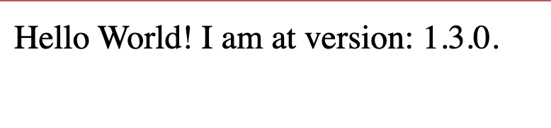
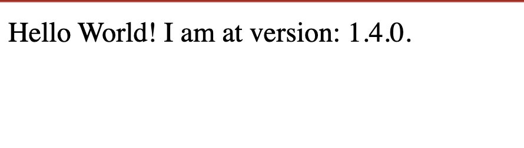

A Project in Otomi is a collection of a Build, a Workload and a Service. The benefit of using Projects is that you can create a Build, a Workload and a Service in one run. Projects are ideal for developers to run multiple code branches next to each other and automatically update the deployment based on a push. In this lab we are going to create a Project and see how everything now comes together is one simple form.

## Create a new Git repository

1. Create a new repo called `hello-world`
2. Set the Default Branch to `master`
3. Clone the Hello World Sample Application from the Red Kubes GitHub repository:

```bash
git clone https://github.com/redkubes/nodejs-helloworld
cd spring-petclinic
```

4. Mirror the Hello World Sample Application to your `hello-world` repo:

```
git push --mirror https://gitea.<your-domain>/<your-user-name>/hello-world.git
```

## Create a Project

1. Go to `Project` and click `Create Project`
2. Fill in a name for the Project. This name is used for the Build (the name of the image) and the Workload. The Service will automatically select the ClusterIp service name based on the Workload name.
3. Click `Create build from source`
4. Click `Next`
5. Choose `Docker` and fill in the repository URL of the `hello-world` repository
6. Enable `Trigger`
7. Select the `Digest` strategy for the `Auto image updater`
8. The `imageRepository` is already filled in. Make sure the `tag` is identical to the tag used for the Build
9. Use the default Chart values 
10. Click `Next`
11. Under `Exposure` select `External`
12. Click `Submit`

## Get the webhook URL

Before we can configure the webhook for the `hello-world` repo in Gitea, we will need the webhook URL. You can find this webhook URL for your build in the list of Builds. Add the webhook URL to your clipboard.

Also notice that the status of the Build shows an exclamation mark. This is because Otomi created the Pipeline, but the PipelineRun is not yet created because it was not triggered yet.

## Create a Webhook

1. In Otomi Console, click on `apps` the left menu and then open `Gitea`
2. In the top menu of Gitea, click on `Explore` and then on the `hello-world` repo
3. Go to `Settings` (top right) and then to `Webhooks`
4. Click `Add Webhook` and select `Gitea`
5. In the `Target URL`, paste the webhook URL from your clipboard.
6. Click `Add Webhook`

## Trigger the build

You can now trigger the build by doing a commit in the `hello-world` repo, or by testing the webhook. Let's test the webhook:

1. In Gitea, go to the `Settings` (top right) of the `hello-world` repo and then to `Webhooks`
2. Click on the webhook we just created
3. In the bottom, click on `Test Delivery`

## Check the status of the Workload

Go to Workloads and click on the Argo CD `application` link of the Workload created by the Project. What do you see? The Argo CD application is still in a `Degraded` state because the image build has not completed yet. When the build in finished and the image can be pulled, the status of the application will automatically become `Healthy`.

## Check the status of the Service

When the state of the Workload becomes `Healthy`, the URL of the Service created by the Project will show the following page:



## Change the code and push the commit

1. Go to the `hello-world` repository
2. Edit the `package.json` and set the `Version` to `1.4.0`
3. Commit the changes

Check the URL again. After a couple of minutes you will see the following page:




