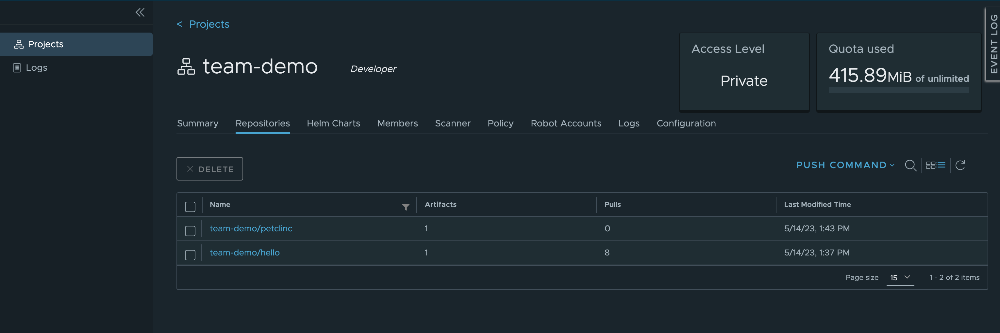

:::info
Prerequisite: For this lab, Harbor and Tekton need to be activated.
:::

When your team is using Harbor for private image registries and Tekton is enabled, you can build images from source using pre-configured Tekton pipelines and buildpacks from [paketo](https://buildpacks.io/docs/buildpack-author-guide/package-a-buildpack/) to build images from application source.

In this lab, you are going to create a build, using the [Spring Pet Clinic sample app](https://github.com/spring-projects/spring-petclinic) and buildpacks. When using the buildpacks option, Otomi uses buildpacks to build an image based on application source code without using a Dockerfile.

1. In the right menu, click on `Build`
2. Click on `Create Build`
3. Fill in the name `petclinic` for your build and a tag (default is tag is latest)
4. Choose `Buildpacks`
5. In the `Application source` section, fill in the following:

- RepoURL: `https://github.com/spring-projects/spring-petclinic`
- revision: `82cb521d636b282340378d80a6307a08e3d4a4c4`

6. Click `Submit`

To see the status of the build, open a Shell (in the right menu in the Console) and run `k9s`. You will now see all the pods in your team's namespace. 2 new pods will start and run the build pipeline tasks.


When the build is ready (the 2 build pods have the status `completed`), you will see the image in Harbor:

1. Open Harbor
2. Click on the project of your team. Here you will see all the registries of the team, including the registry of the new build image
   



When using the Build feature in Otomi, a Tekton Pipeline is created and the pipline is executed only once using a Tekton Pipelinerun. To run the build again using Otomi Console, follow these steps:

1. Change the tag of the build to `1.0.0`
2. Submit changes

To re-build the image using the same tag, restart the build pipeline using the Tekton cli in the Shell:

1. Start a shell in Otomi Console

2. Get the name of the pipeline

```bash
kubectl get pipelines
NAME                         AGE
buildpacks-build-petclinic   5m10s
```

3. Get the name of the pipelinerun:

```bash
kubectl get pipelineruns
NAME                                SUCCEEDED   REASON   STARTTIME   COMPLETIONTIME
buildpacks-build-petclinic-latest   False       Failed   5m18s       4m27s
```

4. Start the pipeline using the pipelinerun:

```bash
tkn pipeline start buildpacks-build-petclinic --use-pipelinerun buildpacks-build-petclinic-latest
PipelineRun started: buildpacks-build-petclinic-latest-j5mmt
```

5. In order to track the PipelineRun progress run:

```bash
tkn pipelinerun logs buildpacks-build-petclinic-latest-j5mmt -f
```
