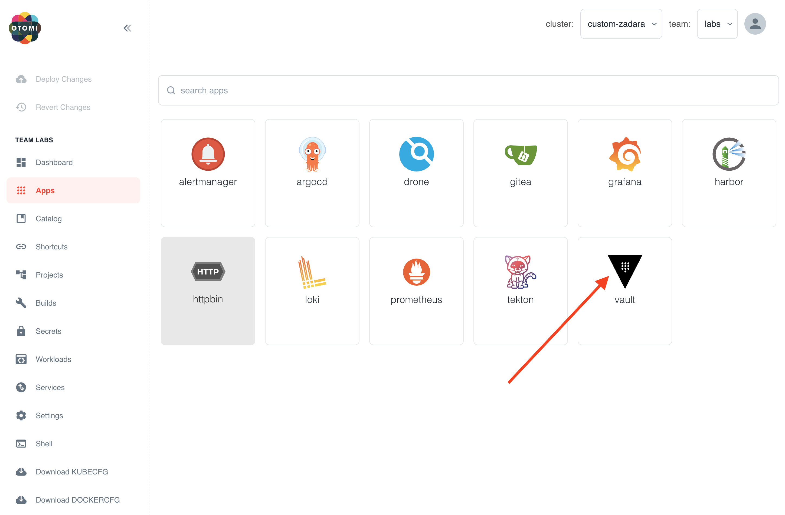
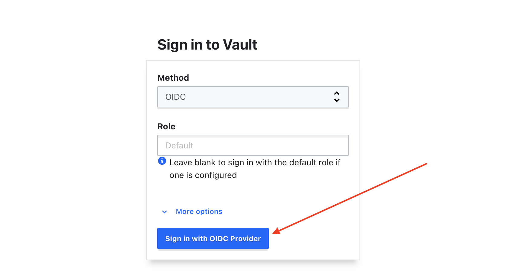
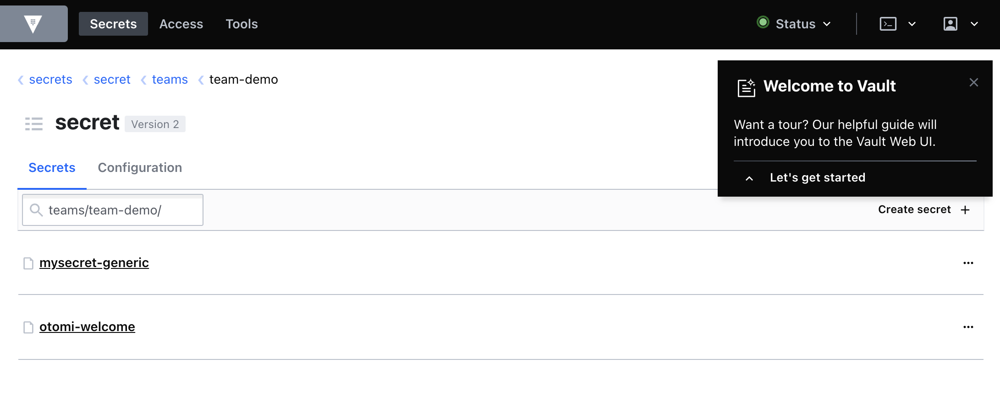
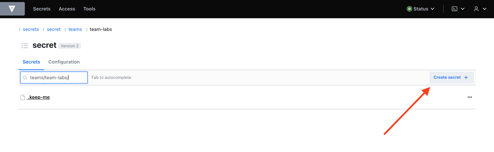
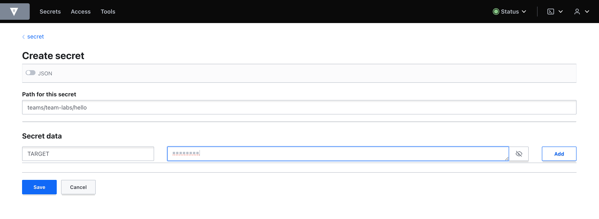
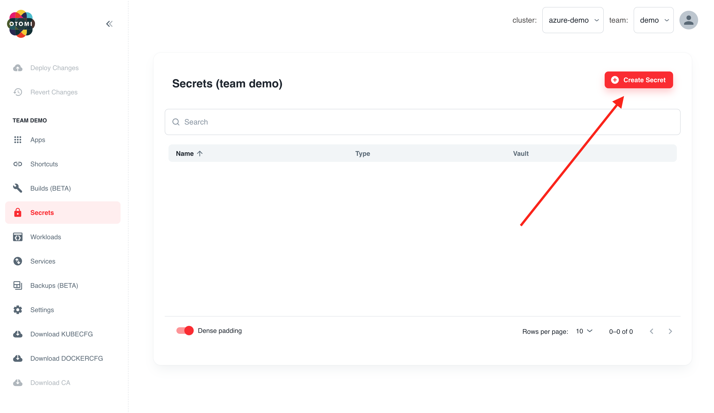
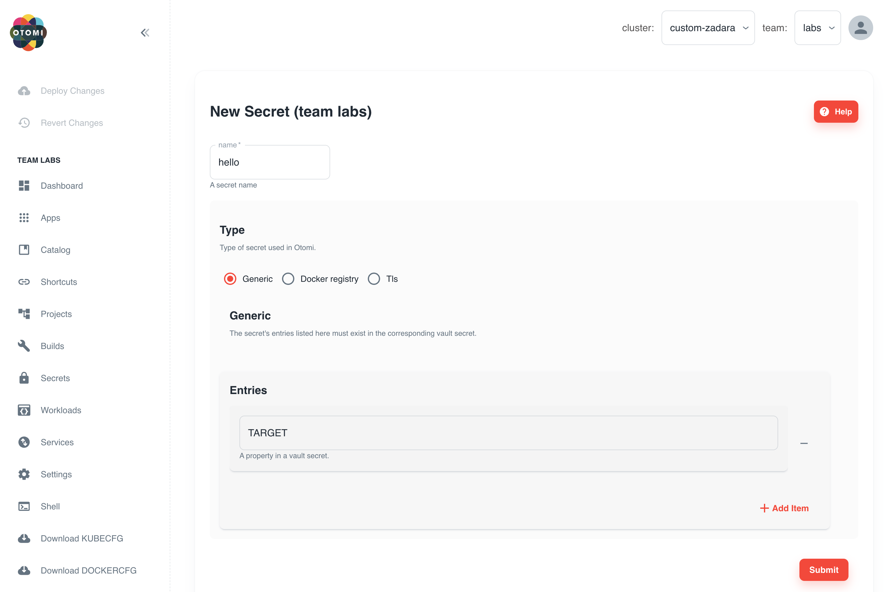

:::info
Hashicorp Vault needs to be activated for this lab.
:::

:::note
Hashicorp Vault is being deprecated in Otomi. We are going to replace this app with solution based on SealedSecrets.
:::

When the platform administrator has enabled Vault, you can use Vault to store and manage secrets. Secrets in Vault can be synchronized to your team namespace as Kubernetes secrets. In this part we'll first create a secret in Vault and then sync the secret to your team namespace using the Secrets option in Otomi Console.

## Create a secret in Vault

- Open the Vault app in your team apps

- Sign in with Method `OIDC`, click on `Sign in with OIDC Provider` and leave role blank

You are now automatically redirected to your team space (secrets/teams/team-demo) in the example below) in Vault.

:::info

In your team space in Vault you will see 2 secrets: 1) `mysecret-generic` and `otomi-welcome`. Do NOT remove these secrets. If you do, the team space in Vault will be removed.

:::

- Click on Create secret

- Provide a name for the secret. We'll use the name hello. The name of the secret in this case will be: `teams/team-demo/hello`
- Fill in a `Key` (TARGET in the example below) and a `value`
- Click on save

The secret is now created in vault. Now we need to synchronize the secret in Vault to Kubernetes so the secret can be used in workloads.

## Create a secret in Otomi

- In the left menu under the Team demo, click Secrets
- Click on Create secret

- Provide a name for the secret. The name should match the name of the secret in Vault
- Select the secret type (Generic in this case)
- Under Entries fill in the `keys` (the keys of the secret in Vault)

- Click submit

- Now click on `Deploy Changes` on top of the left menu

The secret in Vault will now be synchronized to Kubernetes and can be used by the team in any workload. Otomi Console makes this easy by offering a secret selector during the creation of services.

:::info

In this part we only covered using generic secrets. See [here](../console/secrets) to see how you can create TLS and pull secrets
:::
