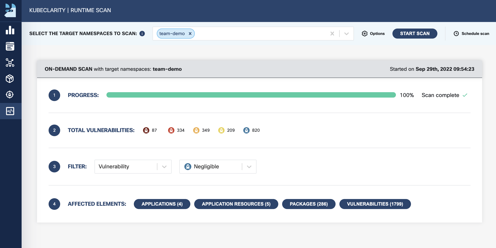

So now you know that you can scan images when pushed to Harbor. But what if you have long running versions of containers? When new vulnerabilities are identified after you scanned the image, you wil only see them when you update your image. For this scenario, Otomi offers 2 realtime container scanning tools:

- KubeClarity for adhoc scanning of containers
- Trivy Operator for automatic daily scanning of containers in all Teams

## Scan running containers with Kubeclarity

:::info
KubeClarity is NOT configured for multi-tenancy. This means everyone can scan any container running on the platform.
:::

In the apps section in Otomi console, you'll see an app called KubeClarity. Click on it.

- In the right menu, click on `Runtime Scan`
- Select your team's namespace for the scan to target
- Click `Start Scan`

When the scan is completed, you'll see

## See Trivy scan results

When Trivy is enabled by the platform admin and Otomi runs in multi-tenant mode, then each team will see the Trivy scan results for all containers deployed within the Team, in a Trivy dashboard in Grafana.

- In the right menu, click on `apps`
- Click on `Grafana`
- Open the Trivy scan results dashboard