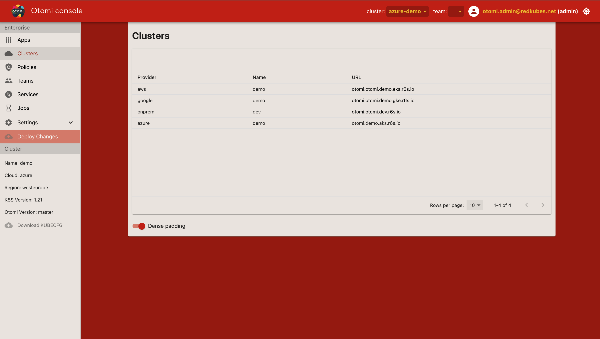

<!-- action  -->

All known Otomi clusters are listed here. Clusters can be sorted based on:

| Property | Description                                                          |
| -------- | -------------------------------------------------------------------- |
| Provider | The configured Otomi provider (`AWS`, `Azure`, `Google` or `Custom`) |
| Name     | The name of the cluster                                              |
| URL      | The URL of the Otomi Console of the cluster                          |

Kubernetes clusters running Otomi can be linked by adding additional clusters in the [Platform Settings / Otomi](settings/otomi.md). This enables to switch context between clusters by selecting `Cluster` in the top bar.
