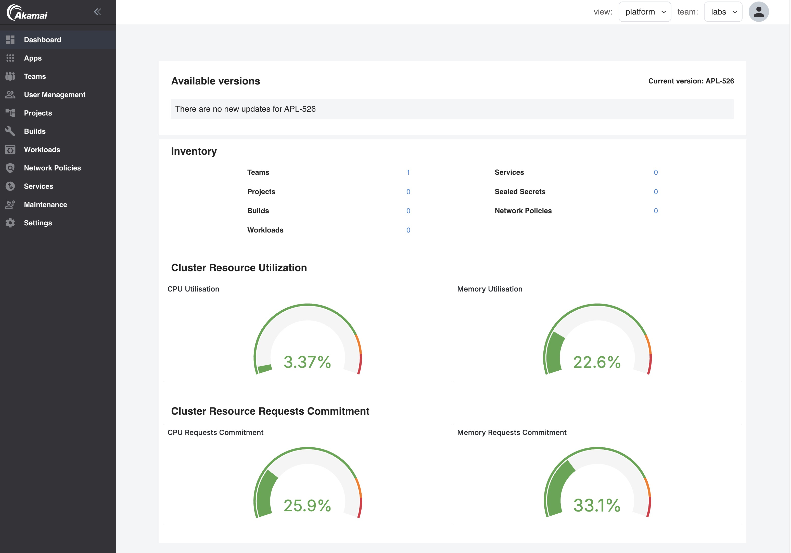

The platform dashboard gives a global overview of information most relevant for the platform admin. In the top bar, select the View: `platform`.

## Prerequisites

The Platform dashboard uses the Platform Grafana and Prometheus to get it's information from. Make sure both are enabled.

## Dashboard elements

The dashboard has 3 elements

- [Inventory](#inventory)
- [Cluster Resource Utilization](#cluster-resource-utilization)
- [Cluster Resource Request Commitments](#cluster-resource-request-commitments)

### Inventory

The inventory shows the Otomi resources within the team. Click on an inventory item to go directly to the full list.

### Cluster Resource Utilization

The Cluster Resource Utilization shows:

- CPU Utilization: The % used CPU of the total amount of CPU available in the cluster
- Memory Utilization: The % used memory of the total amount of memory available in the cluster

### Cluster Resource Request Commitments

The Cluster Capacity shows:

- CPU Request Commitment: The % configured requested CPU of the total amount of CPU available in the cluster
- Memory Request Commitment: The % configured requested memory of the total amount of memory available in the cluster

