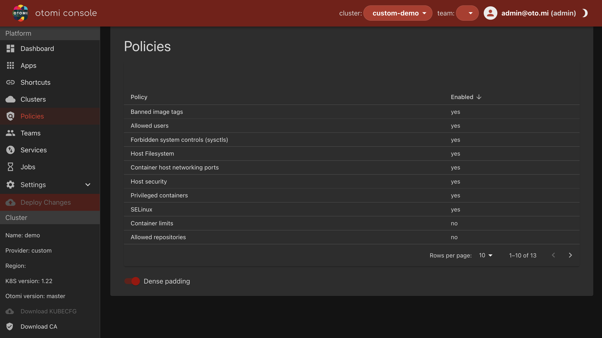

:::info
To enable this feature, first make sure [OPA/Gatekeeper](../../apps/gatekeeper.md) is activated.
:::
<!--  -->

This section allows to turn Open Policy Agent (OPA) / Gatekeeper policies on or off, and also set default parameters to be used by the policies.

| Setting | Description |
| --- | --- |
| banned-image-tags | Add any image tags for containers that are not allowed in your cluster. |
| container-limits | Set global compute limits for your containers. |
| psp-allowed-repos | Add globally allowed repositories for version control. |
| psp-host-filesystem | Set policies for the host filesystem of all Kubernetes cluster nodes. |
| psp-allowed-users | Default user (UID) settings to force containers to run with. It is recommended to at least set 'runAsUser' to 'MustRunAsNonRoot' to disallow root. |
| psp-host-security | Whether a pod is allowed to access the host PID namespace/host IPC, or if a pod defines host aliases. |
| psp-host-networking-ports | Whether a pod can access ports on the host. |
| psp-privileged | Whether privileged containers can escalate to root privileges on the node. |
| psp-capabilities | Whether to allow containers with sufficient capabilities granted to obtain escalated access. |
| psp-forbidden-sysctls | Determine what system controls are allowed or not. |
| psp-apparmor | Prevents an application from accessing files it should not access. |
| psp-seccomp | Reduces the chance that a kernel vulnerability will be successfully exploited. |
| psp-selinux | Security-enhanced Linux. |

Please see the [OPA Gatekeeper policy library](https://github.com/open-policy-agent/gatekeeper-library) as it is the source for the policies here. We made a selection of usable policies for Otomi and adapted them to be used by Conftest as well for static analysis of manifests generated by Otomi.
