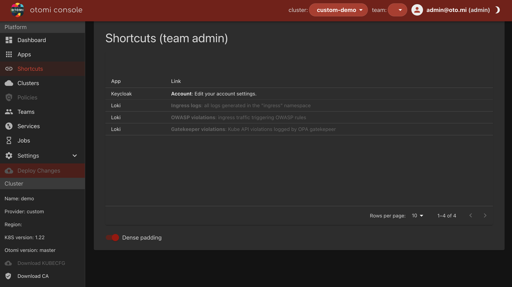

<!--  -->

The Shortcuts section shows all shortcuts created and available on the platform for users with the `otomi-admin` role.

Otomi provides the following default shortcuts to be used:

| App | Link | Comments |
| --- | ---- | -------- |
| Grafana | NGINX: NGINX ingress controller metrics | Only works if Grafana is enabled |
| Keycloak | Account: Edit your account settings | 
| Loki | Ingress logs: all logs generated in the "ingress" namespace | Only works if loki is enabled
| Loki | OWASP violations: ingress traffic triggering OWASP rules | Only works if both Loki and OWASP filtering are enabled
| Loki | Gatekeeper violations: Kube API violations logged by OPA gatekepeer | Only works if both Loki and Gatekeeper are enabled

When a shortcut is grayed-out, the app used for the shortcut is not enabled.