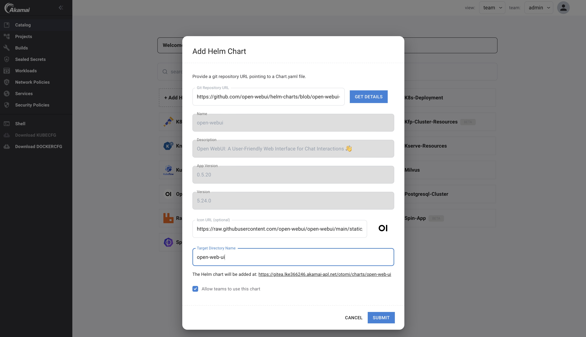
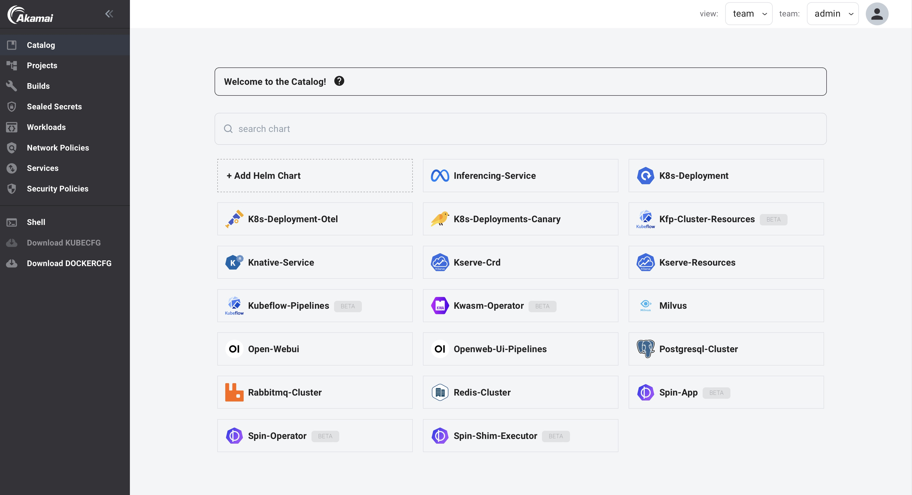

## About the Catalog Helm charts

The Catalog is a library of curated Helm charts to create Kubernetes resources. By default the Catalog contains a set of Helm charts provided to get started quickly, but they can also be modified depending on your requirements or be removed from the Catalog. 

The contents of the Catalog and the RBAC configuration (which Team can use which Helm chart) are managed by the platform administrator.

The Catalog contains a set of Helm charts that can be used as quick starts, but also offers the option (for platform administrators only) to add more Helm charts to the Catalog, using the `+ Add Helm Chart` option.

## Helm charts available for platform administrators

Next to the Helm charts that are by default included in the Catalog and made available for Teams, the Catalog also by default includes a set of curated Helm charts that can only be installed by platform administrators. These Helm charts are visible in the Catalog for the Team `Admin`.

The Helm charts that are by default added to the Catalog are maintained in the [apl-charts](https://github.com/linode/apl-charts) GitHub repository. Currently the following Helm charts are made available for platform-administrators:

1. Kwasm Operator

The `kwasm-operator` Helm chart can be used to add WebAssembly support to the Kubernetes Nodes. `kwasm-operator` is a prerequisite for installing `spin-operator`

2. Spin Operator

The `spin-operator` Helm chart can be used to enable deploying Spin applications to Kubernetes.

3. Spin Shim Executor

The `spin-shim-executor` Helm chart can be used to create a `SpinAppExecutor` utilized by Spin Operator to determine which executor type should be used in running a SpinApp.

4. KubeFlow Pipelines Cluster Resources

The `kfp-cluster-resources` Helm chart can be used to install the KubeFlow Pipelines CRDs.

5. Kubeflow Pipelines

The `kubeflow-pipelines` Helm chart can be used to install KubeFlow Pipelines in any Team.

## Adding Helm charts to the Catalog

1. Select view `team` and select team `admin` in the top bar.

2. Click on `Catalog` in the left menu.

3. You will now see all the templates that are available for use.
.
4. Click on `+ Add Helm Chart`.

5. Fill in a URL that points to a `Chart.yaml`.

6. Click on `GET DETAILS`.

7. Optionally change the `Icon URL` to point to an icon you want to use for this hem chart in the Catalog.

8. If the Helm chart should be made available for all Teams, select `Allow teams to use this chart`.

8. Click `ADD CHART`.

The Helm chart will now be added to the `charts` repository in the Local Git service (Gitea) and will be visible in the Catalog:

