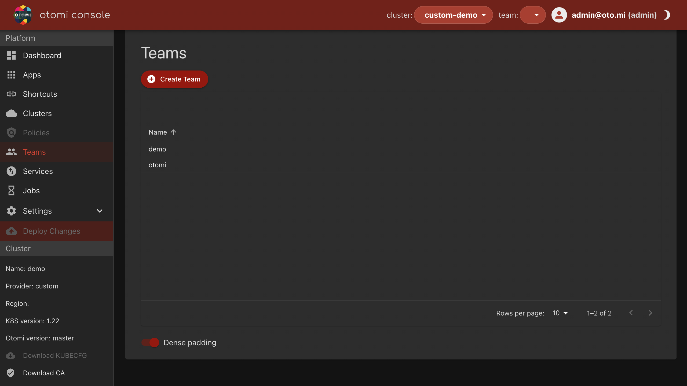

<!--  -->

- Teams are tenants on the platform to support Development/DevOps teams, projects or even DTAP
- A team will get access to Otomi Console, providing access to all the shared apps available on the platform
- Teams can choose to receive alerts in Microsoft Teams, Slack or email and each team will get access to a project in Harbor and a space in Vault to manage secrets
- Teams can be allowed self-service features like configure ingress, configure a notification receiver for alerts, change the OIDC group mappings and download the KubeConfig.

## Team Admin

By default, Otomi creates a team called Team Admin. Admins can use this team to expose any service in the team-admin namespace, but also in other namespaces.

see [Team Services](../../for-devs/console/services) for more info about how to create Services in Otomi and how to configure ingress. The only difference here is that when creating Services in Team Admin, the admin can also select the namespace of the service.

Another difference between the Team Admin and user created Teams is that Team Admin does not have apps and it is not possible to configure any settings for the team-admin namespace.

## Creating new Teams

1. Login with a user who is a member of the `otomi-admin` or `team-admin` role

2. Provide a name for the team (lowercase). The teamname can not be changed afterwards! Creating a team will result in the creation of namespace `team-$NAME`. The name of a team can be max `12` characters.

3. Optional: Provide a OIDC group name/id granting for granting access to team. Only members of the group will get access to the team

4. Optional (only when Alert Manager is enabled): In order to receive alerts, please choose an alerting endpoint:

| Option           | Description                                                                      |
| ---------------- | -------------------------------------------------------------------------------- |
| Slack            | Needs a slack webhook url that will give alerts for warnings and criticals       |
| Microsoft Teams  | Needs two alerting endpoints, for both warnings as well as criticals             |
| Email            | You may provide a list of email addresses for both 'Non Critical' and 'Critical' |
| If none selected | Global (admin) alerting endpoint configuration will be used                      |

5. Optional (Only if Opencost is enabled): Configure billing alert quota

Billing alert quota can be configured to receive an alert when a team hits a quota. Quota are not enforced, meaning a team can still consume resources even when a quota has been reached.

6. Optional: Add Resource Quotas

When required, add resource quota for the team. The resource quota should adhere to the "spec.hard" format as described [here](https://kubernetes.io/docs/concepts/policy/resource-quotas/).

:::note Note

There is no validation as there is no schema published. Add/change resource quota at your own risk.

:::

7. Optional: Configure Azure Monitor

:::note
Configuring Azure Monitor settings will only be active when `cluster.provider=azure`).
:::

Azure Monitor is the platform service that provides a single source for monitoring Azure resources.

| Option                                | Description                   |
| ------------------------------------- | ----------------------------- |
| No Azure monitoring                   | -                             |
| Azure monitoring with global settings | Takes on the global settings  |
| Azure monitoring with custom settings | Overrides any global settings |

8. Private team monitoring

By default, a team will get a dedicated Grafana and Prometheus instance. If Private team monitoring is not enabled, the team will not get a dedicated Grafana and Prometheus instance. This means that to see logs and metrics of team workloads, the platform Grafana instance.

9.  Turn Network Policy On/Off for the team

| Option           | Description                                                                            |
| ---------------- | -------------------------------------------------------------------------------------- |
| Network policies | When enabled team services will be bound by (ingress) network policies                 |
| Egress control   | When enabled team service egress traffic will be limited to pre-defined endpoints only |

10. Add Team self service flags

A user with the `otomi-admin` and `team-admin` role can delegate permissions to modify certain configuration parameters to the team.

| Section | Option               | Description                                                                      |
| ------- | -------------------- | -------------------------------------------------------------------------------- |
| Service | Ingress              | Select to grant the team the permission to configure exposure for Services       |
| Service | Network policy       | Select to grant the team the permission to configure network polices             |
| Team    | Alerts               | Select to grant the team the permission to configure Alerts for the team         |
| Team    | Backup               | Select to grant the team the permission to create Backups for the team           |
| Team    | Billing alert quotas | Select to grant the team the permission to configure Billing alerts for the team |
| Team    | Oidc                 | Select to grant the team the permission to configure OIDC for the team           |
| Team    | Resource quota       | Select to grant the team the permission to configure Resource Quota for the team |
| Team    | Download kube config | Select to grant the team the permission to download the KubeConfig to get Kube API access to the teams namespace        |
| Team    | Download docker config | Select to grant the team the permission to download the Dockerconfig for the teams project in Harbor          |
| Team    | Network Policy       | Select to grant the team the permission to turn on/off network policies          |
| Apps    | ArgoCD               | Select to provide team members access to the team Gitops repository in Gitea   |
| Apps    | Gitea                | Select to provide team members access to Gitea                                   |
