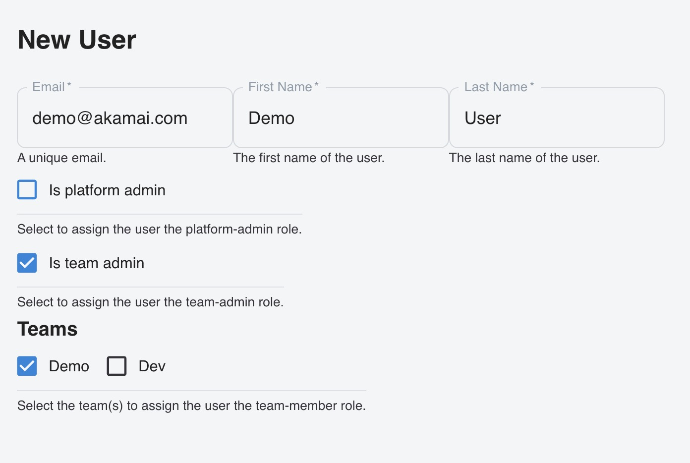

:::info
User Management will only be available when Keycloak is configured to be the Identity Provider. When OIDC is configured, the User Management section will not be available.
:::

:::info
User Management can only be used to manage the users of the Platform instance (single cluster).
:::

## About User Management

What you need to know about the User Management feature:

- Only platform admins can create or delete users in the platform view.
- A Platform admin can assign users the role of Platform Admin, Team Admin or Team Member.
- Users can be created without assigning them to a Team.
- Team admins can assign users the role of Team Member of the Team they administer.
- Team admins can not remove themselves from Teams they administer (this can only be done by the Platform Admin).
- Team admins can not remove other Team Admins from their teams (this can only be done by the Platform Admin).
- Team admins can not add Platform Admins to their Teams.
- Team members are not able to see the User Management section in the menu.
- Users are stored encrypted in the `otomi-values` repository `env/secrets.users.yaml` file.
- The initial login credentials of a new user can be copied from the platform view user management page by platform admins only.
- Users’ passwords are not stored in the values repo (except initial password).
- Users’ passwords can be resetted in Keycloak (Platform admins only!).
- User management follows the Single Source of Truth principle by referencing the `env/secrets.users.yaml` file in the `otomi-values` repository. If a new user is created directly in Keycloak, this user will be deleted at the next commit.
- Kubernetes secrets are used to pass user data between Pods, but there is a limit for user-defined variables. The maximum size of a user-defined environment variable is 32,767 characters. This limits the amount of users that can be created to around 200.

## Creating Users

1. Select the `Platform` view in the top bar.

2. Click on `User Management` in the left menu.

3. Click on `Create User`.

4. Fill in a unique `email` address and the first and last name of the new user.

5. Add the new user to the required groups:

- Select `Is platform admin` to add the user to the `platform administrators` group.
- Select `Is team admin` to add the user to the `team administrators` group. When the user becomes a Team admin, optionally also select the Teams the user is going to administer.
- Select a `Team` to add the user to the `team members` group.

6. Click `Submit`.

7. Click `Deploy Changes`.

8. In the list of Users, click on the `copy initial credentials to clipboard` icon.

9. Send the initial credentials to the new user.

The new user will be prompted to change the initial password at first login.

The following example shows how to create a user account and assign the user the `team-admin` role for the Team `Demo`:

## Assinging Users to Teams

1. Select the `Team` view in the top bar and the Team that you like to administer.

2. Search for the user you would like to make a member.

3. Select the `Assign to team <team-name>` checkbox.

4. Click on `Update Users`.

5. Click on `Deploy Changes`.

