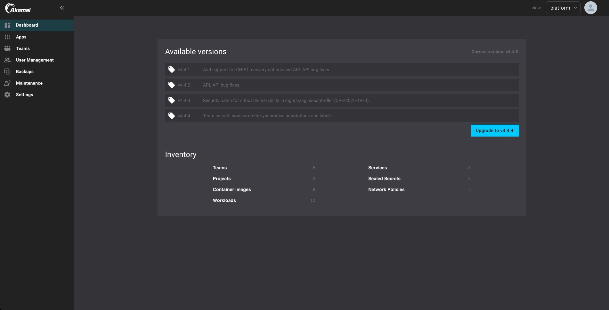

The Akamai App Platform is regularly updated to provide new features, improvements, and security enhancements. This page outlines the recommended approach for performing an upgrade.

## Upgrading through the Platform Dashboard

The primary method to upgrade the Akamai App Platform is via the platform dashboard. Within the dashboard you can see your current version in the top right corner, there is also a table listing all available versions, each accompanied by a brief description of the changes introduced in that release. To see the full release notes of that version you can click on the version tag. To initiate the upgrade, simply click the `Upgrade to vX.Y.Z` button to upgrade to the latest version.

1. As a platform admin go to the platform view.

2. In the left menu, click on `Dashboard`.

3. Click the `Upgrade to vX.Y.Z` button and the Akamai App Platform will be upgraded to the newest version.

:::note
If there is no newer version a message will be displayed instead showing that there are no new updates for your version.
:::
