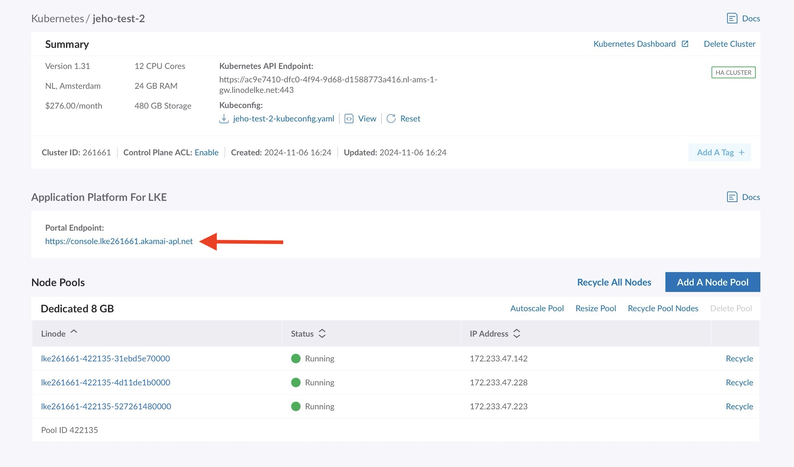
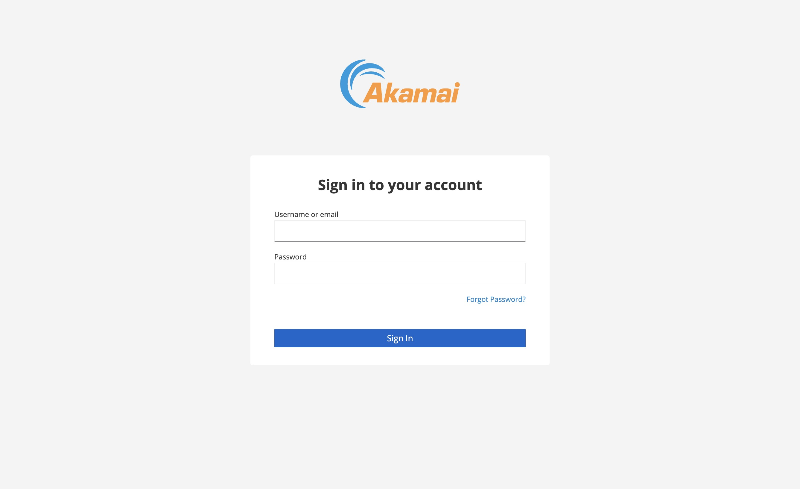

# Deploy Akamai App Platform on LKE

## Create a Kubernetes cluster with App Platform enabled

These instructions provide the basic steps for deploying App Platform on an LKE cluster. For more complete instructions on creating an LKE cluster, see the [Create a cluster](https://techdocs.akamai.com/cloud-computing/docs/create-a-cluster) guide.

1. Log in to your Cloud Manager account.

2. Select Kubernetes from the main navigation menu and then click **Create Cluster**.

3. The _Create a Kubernetes Cluster_ page appears. At the top of the page, select the following options

- In the **Cluster Label** field, provide a name for your cluster. The name must be unique between all of the clusters on your account. This name is how you identify your cluster in Cloud Manager.

- From the **Region** dropdown menu, select the region where you would like your cluster to reside.

- From the **Version** dropdown menu, select a Kubernetes version to use on your cluster.

4. In the **App Platform** section, select _Yes, enable App Platform for LKE_.

:::note
App Platform requires HA control plane. When you enable the **App Platform** setting, the **HA control plane** setting is automatically enabled.
:::

5. In the **Add Node Pools** section, select the required resources for the worker nodes. To the right of each plan, select the plus + and minus - to add or remove a node to a node pool one at time.

:::note
During the beta period, App Platform requires a node pool with at least **3 worker** nodes with a minimum of **8 GB memory** and **4 CPUs** per node.
:::

:::note
App Platform is not supported in combination with Shared CPU Linode plans.
:::

6. Select **Add** to include the node pool in your configuration. If you need more hardware resources after you deploy your cluster, you can always [edit your Node Pool](https://techdocs.akamai.com/cloud-computing/docs/manage-nodes-and-node-pools).

7. Once a node pool has been added to your configuration, it is listed in the **Cluster Summary** section detailing your cluster's hardware resources and monthly cost. Additional pools can be added before finalizing the cluster creation process by repeating the previous step for each additional pool.

:::info
The App Platform for LKE requires HA control plane to be enabled. When App Platform for LKE is enabled, HA control plane will automatically be enabled.
:::

:::info
It is advised to configure Control Plane ACL. This will restrict access to the Kubernetes API. The ACL will NOT restrict access to the App Platform Console!
:::

5. In the Add Node Pools section, select the required resources for the Linode worker node(s). To the right of each plan, select the plus + and minus - to add or remove a Linode to a node pool one at time.

:::info
During the Beta period the App Platform for LKE requires a node pool with at least **3 worker** nodes with a minimum of **16 GB memory** and **4 CPUs** per node. Make sure to select the required Linode plan.
:::

6. Select Add to include the node pool in your configuration. If you decide that you need more hardware resources after you deploy your cluster, you can always [edit your Node Pool](https://techdocs.akamai.com/cloud-computing/docs/manage-nodes-and-node-pools).

:::info
The App Platform for LKE is not supported in combination with Shared CPU.
:::

7. Once a pool has been added to your configuration, it is listed in the Cluster Summary on the right-hand side of Cloud Manager detailing your cluster's hardware resources and monthly cost. Additional pools can be added before finalizing the cluster creation process by repeating the previous step for each additional pool.

8. When you are satisfied with the configuration of your cluster, click the **Create Cluster** button. This creates your cluster and displays the cluster's details page in the Cloud Manager. Once the cluster has been fully provisioned, App Platform is installed. **The installation of App Platform takes around 10 to 15 minutes.** When the installation is finished, the URL of the **Portal Endpoint** is displayed in the **App Platform** section. The progress of the installation is checked every 60 seconds. When the installation is still in progress, the message “Installation in progress” is displayed instead of the URL of the Portal Endpoint.

9. When the installation of both the LKE cluster and App Platform is complete, click on the provided URL of the Portal Endpoint:



This takes you to App Platform Portal login page:



10. Continue with the next steps to get the initial credentials needed to sign in.

## Access and download your Kubeconfig

1. To access your cluster's Kubeconfig, log in to your Cloud Manager account and navigate to the Kubernetes section.

2. From the Kubernetes listing page, click on your cluster's _more options_ ellipsis and select **Download Kubeconfig**. The file is saved to your computer's downloads folder.

3. Open a terminal shell and save your Kubeconfig file's path to the $KUBECONFIG environment variable. In the example command, the Kubeconfig file is located in the **Downloads** folder, but you should alter this line with this folder's location on your computer:

   ```bash
   export KUBECONFIG=~/Downloads/kubeconfig.yaml
   ```

## Obtain the initial access credentials and sign in

1. Perform the following command to obtain the user name:

   ```bash
   kubectl get secret platform-admin-initial-credentials -n keycloak --template={{.data.username}} | base64 -d
   ```

2. Perform the following command to obtain the initial password:

   ```bash
   kubectl get secret platform-admin-initial-credentials -n keycloak --template={{.data.password}} | base64 -d
   ```

3. Navigate back to App Platform Portal login page in your web browser and sign in with these credentials.

4. The first time you log in, you are prompted to change your password. Enter your new password and click **Submit**. If you need to change your password later, see the [Change user passwords](http://localhost:3001/docs/for-ops/how-to/change-user-passwords) and [Change admin password](http://localhost:3001/docs/for-ops/how-to/change-admin-password) guides.

5. After changing your password, you are taken to the main dashboard. The first time you log in, you are prompted to configure Object Storage. See the [Provision Object Storage for the App Platform](#provision-object-storage-for-the-app-platform) section below.

## Provision Object Storage for the App Platform

Aftering logging in to the App Platform Portal for the first time, you should configure Object Storage. This is not required, but strongly recommended as this will prevent _out of disk space errors_ when using Storage Volumes for integrated applications. Using Object Storage also has the advantage of creating backups of all databases used by the platform.

1. The **Object Storage Wizard** screen is automatically displayed when logging in for the first time. This walks you through adding an API token so that it can automatically create amd configure all required Object Storage buckets. Click **Yes** to continue with this process. If you don’t want the platform to create all the required buckets, then click **Skip for now**. In this case, some features like creating backups of databases will not be available. You can start the Wizard at any time in the Portal (Platform View: Maintenance, Show Object Storage Wizard).

1. Follow the instructions to [create a Personal Access Token](https://techdocs.akamai.com/linode-api/reference/get-started#personal-access-tokens). The API token only needs **Read/Write** to Object Storage. Once created, save or copy the generated access token.

1. Paste the API token into the wizard and select the region where the buckets should be created from the dropdown list. This region should match the region you selected when deploying your LKE cluster.

1. Click `Submit`.

All the required buckets are now created and the platform will be configured to use Object Storage to store persistent data and backups. The provided Personal Access Token will not be stored. The created buckets will have the `<cluster-id>` prefix`

## Onboard Teams and Users

You can now start enabling Applications, onboarding [Teams](../../for-ops/console/teams) and create [Users](../../for-ops/console/user-management).

We recommend to go through the [Hands-on Labs](../labs/overview) to learn how to take advantage of the Akamai App Platform.

## Known issues

Are you experiencing issue during installation or operation? Check the [Known Issues page](../../for-ops/known-issues.md)
