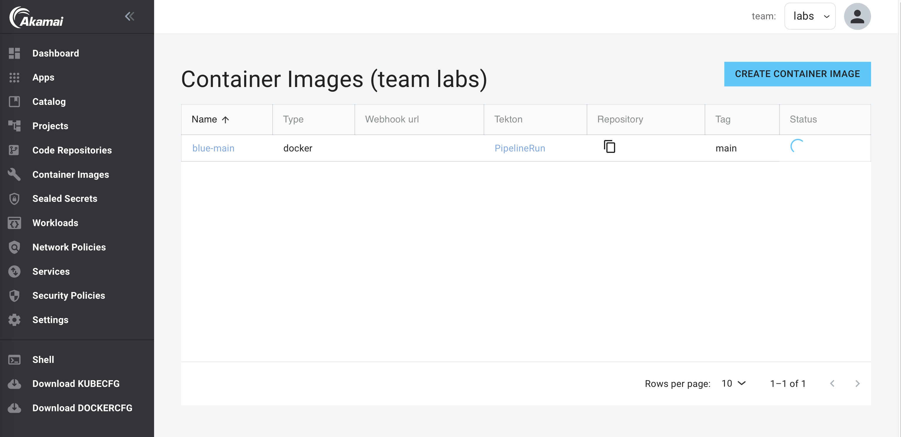

:::info
Harbor needs to be activated for this lab.
:::

When your team is using Harbor for private image registries, you can build images from source using pre-configured Tekton pipelines using the [paketo](https://buildpacks.io/docs/buildpack-author-guide/package-a-buildpack/) (used by Buildpacks mode) task or the [Kaniko](https://github.com/GoogleContainerTools/kaniko) task (used by the Docker mode) to build images from application source.

## Build the blue image

1. In the left menu, click on `Builds`.

2. Click on `Create Build`.

3. Fill in the name `blue` for your build and a tag (default tag is latest).

4. Choose `Docker` and fill in the repo URL for the `blue` repo created in the previous lab.

5. Click `Submit`.

6. Click `Deploy changes`.

Now a Tekton Pipeline and PipelineRun resource to build the image will be created. This will take around 30 seconds. Then the PipelineRun will start building the image. During this time the status will show `in progress`:



When the build is finished, the status will show `healthy`:


To see the full PipelineRun of the build, go to the list of Builds and click on `PipelineRun` of the `blue` build. This will open the Tekton Dashboard and show the status of the PipelineRun of the build:


When the build is ready you can see the image in Harbor:

1. Open Harbor.

2. Click on the project of your team. Here you will see all the registries of the team, including the registry of the new build image.


## Re-run the build (optional)

For this step you need to have the Tekton cli installed. If you don't have the Tekton cli installed, you can install it from this page: [https://tekton.dev/docs/cli/](https://tekton.dev/docs/cli/)

To run the build again using the Console, follow these steps:

1. Change the tag of the build for example to `v1.0.0`.

2. Click `Submit`.

3. Click `Deploy changes`.

To re-build the image using the same tag, restart the build pipeline using the Tekton cli in the Shell:

1. Start a shell in the Console

2. Get the name of the pipeline

```bash
kubectl get pipelines
NAME                         AGE
docker-build-blue            41h
```

3. Get the name of the pipelinerun:

```bash
kubectl get pipelineruns
NAME                       SUCCEEDED   REASON      STARTTIME   COMPLETIONTIME
docker-build-blue-latest   True        Succeeded   41h         41h
```

4. Start the pipeline using the pipelinerun:

```bash
tkn pipeline start docker-build-blue --use-pipelinerun docker-build-blue-latest
PipelineRun started: docker-build-blue-latest-j5mmt
```

5. In order to track the PipelineRun progress run:

```bash
tkn pipelinerun logs docker-build-blue-latest-j5mmt -f
```

But it's easier to just open the Tekton dashboard and Click on `PipelineRuns`.
