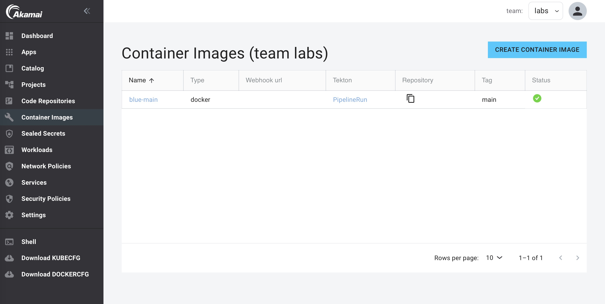
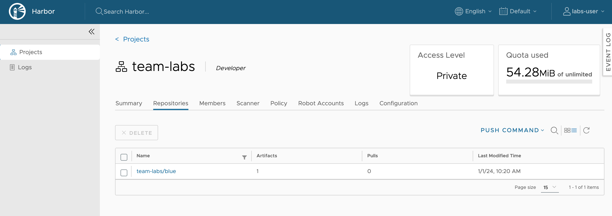

:::info
The Harbor App needs to be activated for this lab.
:::

You can use the Container Images feature in App Platform to create container images from source with pre-configured Tekton pipelines using the [paketo](https://buildpacks.io/docs/buildpack-author-guide/package-a-buildpack/) (used by Buildpacks mode) task or the [Kaniko](https://github.com/GoogleContainerTools/kaniko) task (used by the Docker mode) to build images from application source.

## Create the blue image

1. In the left menu, click on `Container Images`.

2. Click on `CREATE CONTAINER IMAGE`.

3. Select the `Docker` build task.

4. Select the `blue` repository from the Repository drop-down list.


5. Select the Reference (branch or tag). The `blue` repo only has one branch (`main`).

6. Optionally you can change the Image name and tag. This is the name and tag used to store the image in the private Harbor image registry.

7. Click `Create Container Image`.

Now a Tekton Pipeline and PipelineRun resource to build the image will be created by the App Platform. This will take around 30 seconds. Then the PipelineRun will start building the image. During this time the status will show `in progress`:


When the build is finished, the status will show `ready`:



To see the full PipelineRun of the build, go to the list of Builds and click on `PipelineRun` of the `blue` build. This will open the Tekton Dashboard and show the status of the PipelineRun of the build:


When the build is ready you can see the image in Harbor:

1. Open Harbor.

2. Click on the project of your team. Here you will see all the registries of the team, including the registry of the new build image.



## Manually re-run the build task (optional)

For this step you need to have the Tekton cli installed. If you don't have the Tekton cli installed, you can install it from this page: [https://tekton.dev/docs/cli/](https://tekton.dev/docs/cli/)

To re-build the image using the same tag, restart the build pipeline using the Tekton cli in the Shell:

1. Start a shell in the Console

2. Get the name of the pipeline

```bash
kubectl get pipelines
NAME                         AGE
docker-build-blue-main       41h
```

3. Get the name of the pipelinerun:

```bash
kubectl get pipelineruns
NAME                       SUCCEEDED   REASON      STARTTIME   COMPLETIONTIME
docker-build-blue-main     True        Succeeded   41h         41h
```

4. Start the pipeline using the pipelinerun:

```bash
tkn pipeline start docker-build-blue-main --use-pipelinerun docker-build-blue-main
PipelineRun started: docker-build-blue-main-j5mmt
```

5. In order to track the PipelineRun progress run:

```bash
tkn pipelinerun logs docker-build-blue-main-j5mmt -f
```

But it's easier to just open the Tekton dashboard and Click on `PipelineRuns`.
