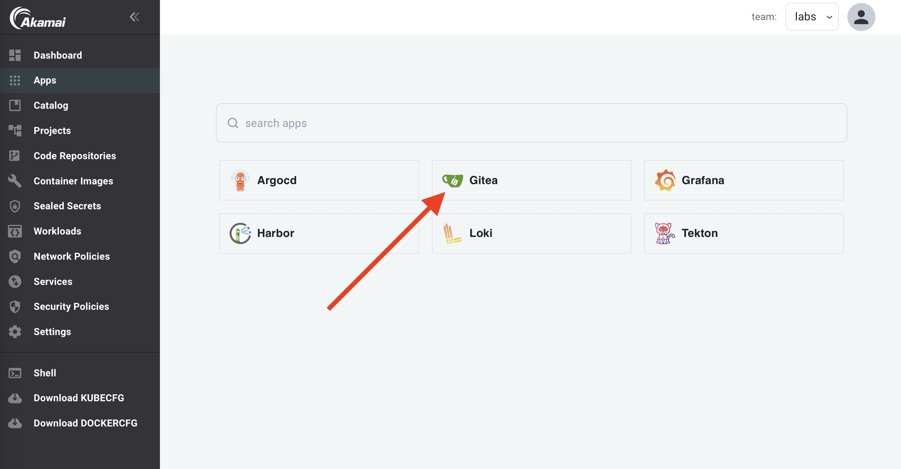
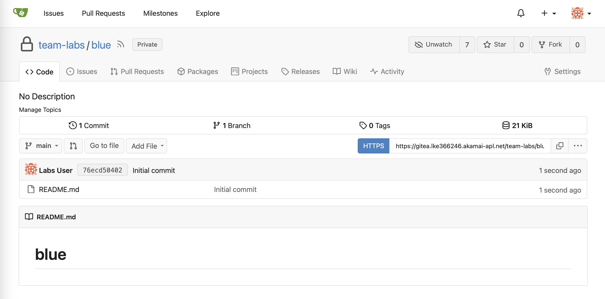

As a developer you'll need a Git repository for your code. Most organizations will probably use a Git service like GitLab or GitHub. But if you don't, you can use the integrated Git service powered by Gitea.

As a Team member, you can create and manage your own repositories.

:::info
Team members first have to sign in to Gitea (using OpenID), after which they are automatically granted access to the Team's organization in Gitea.
:::

:::info
The default `platform-admin` account does not have access to Team organizations in Gitea. When using the platform-admin account, make sure to add your account to the Owners group of the Team's organization in Gitea.
:::

In the labs we'll be using a Team called `labs` and a user called `labs-user@labs.com`.

## Create the private repository

In the apps section in the console, you'll see an app called Gitea. Click on it.



Now follow these steps:

1. Click on `+ New Repository`


2. Select `team-labs`(the Team that you are a member of) as the `Owner`.

3. Add the name `blue` for the repository.

4. Select `Make Repository Private`.

5. Select `Initialize Repository`.

6. Click on `Create Repository`.

Your repo is now ready to be used!



Add the following 2 files to the repository:

Add `Dockerfile`:

```Dockerfile
FROM nginxinc/nginx-unprivileged:stable
COPY blue.html /usr/share/nginx/html/index.html
EXPOSE 8080
```

Add `blue.html`:

```html
<!DOCTYPE html>
<html>
  <head>
    <meta charset="utf-8" />
    <title>Sample Deployment</title>
    <style>
      body {
        color: #ffffff;
        background-color: blue;
        font-family: Arial, sans-serif;
        font-size: 14px;
      }
      h1 {
        font-size: 500%;
        font-weight: normal;
        margin-bottom: 0;
      }
      h2 {
        font-size: 200%;
        font-weight: normal;
        margin-bottom: 0;
      }
      .centered-text {
          text-align: center;
      }
    </style>
  </head>
  <body>
  <div class="centered-text">
      <h1>Welcome to Blue</h1>
  </div>
  </body>
</html>
```

In the upcoming labs we are going to use the `blue` repository, but we'll also need a `green` repository. 
Create the `green` repository and add the same 2 files that where added to the `blue` repo, but change `blue` into `green`:

1. Click on `+ New Repository`.

2. Select `team-labs`(the Team that you are a member of) as the `Owner`.

3. Add the name `green` for the repository.

4. Optional: Enable `Initialize Repository`.

5. Make Repository Private.

6. Click on `Create Repository`.

Add the following 2 files to the repository:

Add `Dockerfile`:

```Dockerfile
FROM nginxinc/nginx-unprivileged:stable
COPY green.html /usr/share/nginx/html/index.html
EXPOSE 8080
```

Add `green.html`:

```html
<!DOCTYPE html>
<html>
  <head>
    <meta charset="utf-8" />
    <title>Sample Deployment</title>
    <style>
      body {
        color: #ffffff;
        background-color: green;
        font-family: Arial, sans-serif;
        font-size: 14px;
      }
      h1 {
        font-size: 500%;
        font-weight: normal;
        margin-bottom: 0;
      }
      h2 {
        font-size: 200%;
        font-weight: normal;
        margin-bottom: 0;
      }
      .centered-text {
          text-align: center;
      }
    </style>
  </head>
  <body>
    <div class="centered-text">
      <h1>Welcome to Green</h1>
    </div>
  </body>
</html>
```

Now continue with the next lab to [register the code repositories](register-repos.md) in App Platform.