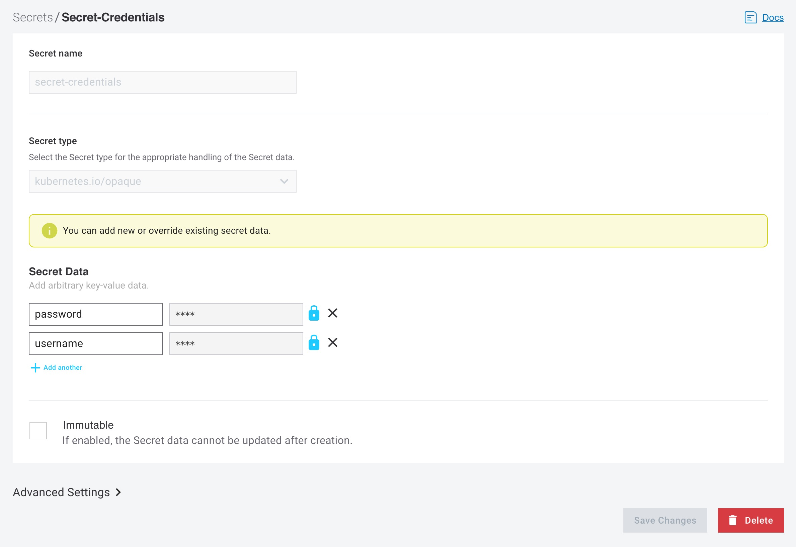
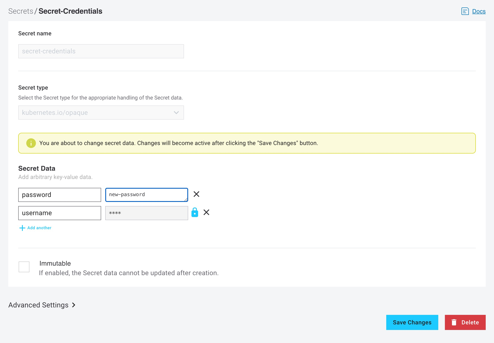
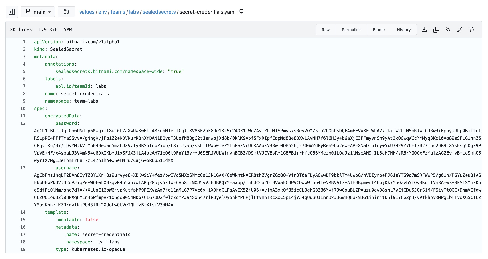

In this lab we will create secrets using Sealed Secrets and see how to securely store sensitive information in a git repository.

## Creating a Secret

1. Click on the `Secrets` in the sidebar.

2. Click on `Create Secret`. This will take you to the page where you can create a secret.

3. Fill in a name for your secret. In this lab we will use the name `secret-credentials`

4. Select the secret type. In this lab we will create a secret of type `kubernetes.io/opaque`.

5. Click on `+Add another` so you can fill in two key-value pairs

6. In the `Secret data` section. Add the following key-value pairs:

- `key=password value=helloworld`
- `key=username value=labs-user`


7. Click on `Create Secret`.

:::note
The secret value will only be visible at the time of creation. After creation, the value field will display asterisks `****` to indicate the data is encrypted and cannot be revealed through the interface, though it can be overwritten. To overwrite the secret, click on the lock `🔒` icon next to the value field, enter the new secret value, and click on `Save Changes`.
:::




## Checking the GIT repository

Now go to Gitea and check the `otomi/values` repository. You will see that under `values/env/teams/<team-name>/sealedsecrets/secret-credentials.yaml` the secret is stored in yaml, but the values are encrypted.



## Checking the Kubernetes secret

The only way to see the values of the secret is to decrypt the secret. The secret values are stored as base64 encoded values. In the left menu click on Shell and run the following command:

```bash
kubectl get secret secret-credentials -o yaml -n team-labs
```

This wil return the secret in yaml format. The values are stored as base64 encoded values.

```yaml
apiVersion: v1
data:
  password: aGVsbG93b3JsZA==
  username: bGFicy11c2Vy
kind: Secret
metadata:
  creationTimestamp: '2025-11-11T13:44:16Z'
  name: secret-credentials
  namespace: team-labs
  ownerReferences:
    - apiVersion: bitnami.com/v1alpha1
      controller: true
      kind: SealedSecret
      name: secret-credentials
      uid: fc1014f6-0212-49f7-a95d-c4169e053b60
  resourceVersion: '240057431'
  uid: b76d6944-fa91-4392-ba4c-80e3e07c7e82
type: kubernetes.io/opaque
```

If you want to decode the secret you can use `base64 --decode`. Run the following command:

```bash
kubectl get secret secret-credentials -n team-labs -o jsonpath="{.data.password}" | base64 --decode
```

Expected output:
```
helloworld
```
