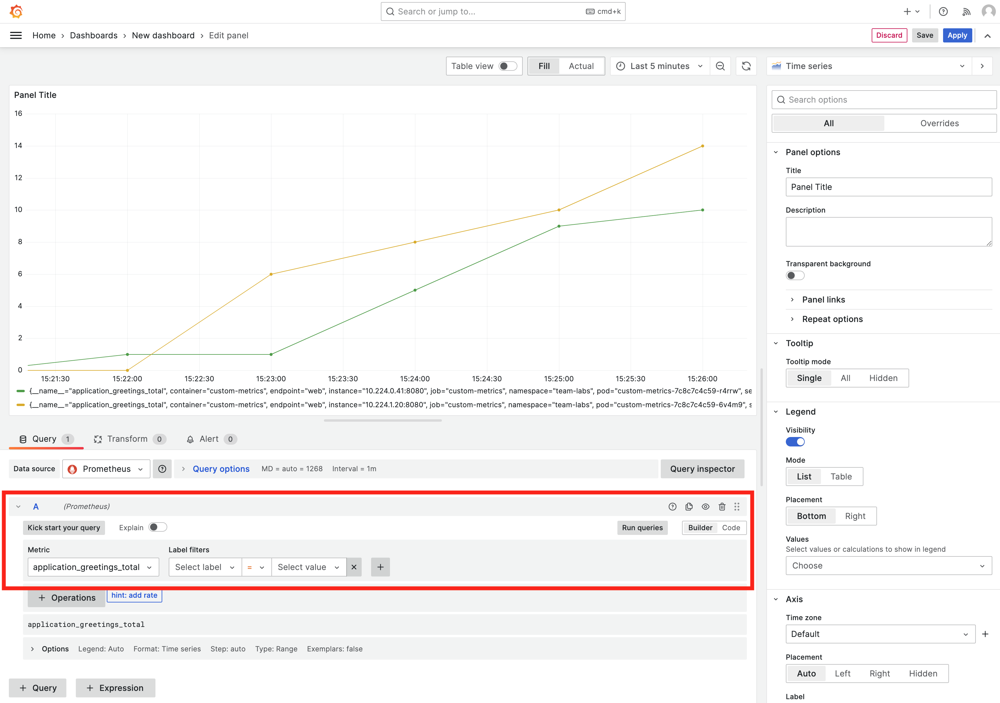
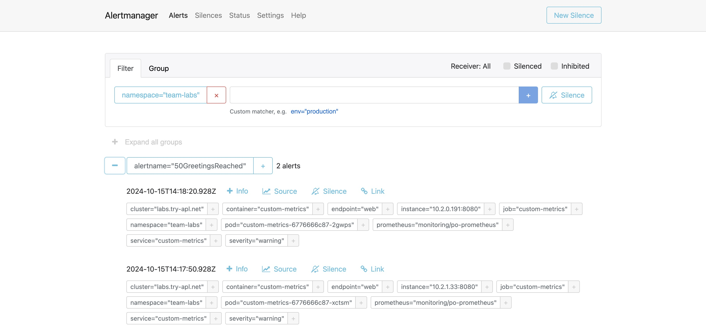

:::info
For this lab Grafana and Alertmanager need to be enabled for the Team.
:::

To be able to collect custom metrics you will first need to configure your app to expose metrics. This is called instrumentation of code and can include annotating the code with metadata, or adding in logic to calculate and expose data.

Instrumenting code means you write code to expose information about the technical, business, and customer context. This information can then be collected and analyzed using Prometheus and Grafana.

In this lab we'll use a container that exposes custom metrics and then show how the metrics can be collected and analysed.

## Create a Workload

1. Go to the Catalog and click on the `k8s-deployment` template.

2. Click on the `Values` tab.

3. Fill in the name `custom-metrics`.

4. Use the following values:

```yaml
image:
  repository: quay.io/rbaumgar/monitor-demo-app-jvm
  pullPolicy: IfNotPresent
  tag: latest
containerPorts:
  - name: web
    containerPort: 8080
    protocol: TCP
servicePorts:
  - port: 8080
    targetPort: 8080
    protocol: TCP
    name: web
replicaCount: 1
serviceMonitor:
  create: true
  endpoints:
    - interval: 30s
      port: web
      scheme: http
      path: /q/metrics
```

5. Click `Submit`.

Our metrics will now be scraped by the Platform Prometheus. Before we continue, let's first generate some load:

1. Expose the `custom-metrics` service (see lab [Expose services](expose-services.md)).

2. Run the following command in your terminal:

```bash
for i in {1..1000}; do curl https://custom-metrics-labs.<your-domain>/hello; sleep 10; done
```

3. Wait for approximately 10 minutes...

## Create a dashboard in Grafana to use the metrics

1. In the left menu, click on `Apps` and open `Grafana`.

2. Go to the Grafana dashboard homepage.

3. In the top right click on `New` and then `New Dashboard`.

4. Click `+ Add visualization`.

5. In the `Data source` tab select `Prometheus Platform`.

6. In the `A` collapsible section, select a metric from the `Metric` drop-down list. In our example we use the `application_greetings_total` metric.

7. Click `Run queries`.

8. You should now see a `Time series` graph like this:



9. Save the dashboard in Grafana.

## Make the dashboard persistent

Now you know how to create a dashboard in Grafana for your custom metrics. You could now save the dashboard, but if Grafana would get re-started, the dashboard will be gone. To make the dashboard persistent we need to add it to a configmap.

1. Go to `apps` and open `Gitea`.

2. In the list of repositories there is a repository called `otomi/team-<team-name>-argocd`. Go to this repository.

3. Click `Add File` and then `New File`.

4. Name the file `my-custom-dashboard.yaml`.

5. Add the following manifest to the file:

```yaml
apiVersion: v1
kind: ConfigMap
metadata:
  name: my-custom-dashboard
  labels:
    grafana_dashboard: "1"
    release: grafana-dashboards-labs # change labs to the name of your team
data:
  my-dashboard.json: |-
    # paste your dashboard json here
```

6. Before commiting changes, go back to Grafana.

7. Click on `Dashboard settings` (in the top right).

8. Go to `JSON model` tab.

9. Copy the JSON model and paste it into the ConfigMap. Make sure to indent with 4.

10. Delete the dashboard created in Grafana.

11. Commit changes in Gitea.

The dashboard will now automatically be loaded into the Team's Grafana instance.

## Create custom rules

Now we are exporting metrics, these metrics can also be used to generate alerts. To generate alerts, we first need to create a Prometheus `Rule`:

1. Go to `apps` and open `Gitea`.

2. In the list of repositories there is a repository called `otomi/team-<team-name>-argocd`. Go to this repository.

3. Click `Add File` and then `New File`.

4. Name the file `my-custom-rules.yaml`.

5. Add the following manifest to the file:

```yaml
apiVersion: monitoring.coreos.com/v1
kind: PrometheusRule
metadata:
  labels:
    prometheus: system
  name: labs-custom-rules
spec:
  groups:
  - name: custom.rules
    rules:
    - alert: 50GreetingsReached
      annotations:
        description: We reached 50 greetings!
        summary: The number of greetings has reached more than 50.
      expr: application_greetings_total > 50
      for: 1m
      labels:
        severity: warning
```

6. Commit changes in Gitea.

## See alerts based on the rule in Alertmanager

1. Go to `Apps` and open `Alertmanager`

2. You will see Alertmanager has received the alerts from Prometheus:



If a receiver has been configured for the Team, like Slack, then you would also have received a message with the alert.