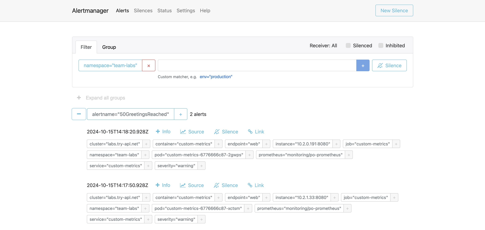

Now we are exporting metrics, these metrics can also be used to generate alerts. To generate alerts, we first need to create a Prometheus `Rule`:

1. Go to `apps` and open `Gitea`.

2. In the list of repositories there is a repository called `otomi/team-<team-name>-argocd`. Go to this repository.

3. Click `Add File` and then `New File`.

4. Name the file `my-custom-rules.yaml`.

5. Add the following manifest to the file:

```yaml
apiVersion: monitoring.coreos.com/v1
kind: PrometheusRule
metadata:
  labels:
    prometheus: team-labs # change labs to the name of your team
  name: labs-custom-rules
spec:
  groups:
  - name: custom.rules
    rules:
    - alert: 50GreetingsReached
      annotations:
        description: We reached 50 greetings!
        summary: The number of greetings has reached more than 50.
      expr: application_greetings_total > 50
      for: 1m
      labels:
        severity: warning
```

6. Commit changes in Gitea.

## See rules in Prometheus

Now let's check to see if Prometheus has picked-up the rule:

1. Go to `Apps` and open `Prometheus`.

2. In the menu click on `Status` and then `Rules`. You should now see the rule:


3. In the menu in Prometheus, click `Alerts`

4. You should see an alert has been fired:


## See alerts in Alertmanager

1. Go to `Apps` and open `Alertmanager`

2. You will see Alertmanager has received the alerts from Prometheus:



If a receiver has been configured for the Team, like Slack or email, then you would also have received a message with the alert.