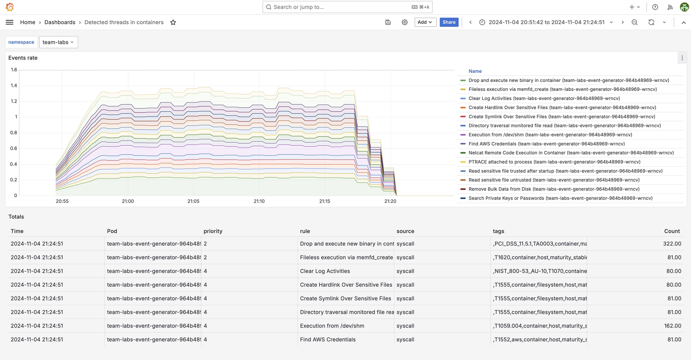

:::info
Falco needs to be activated for this lab.
:::

:::info
This lab requires a user with the `platform-administrator` role!
:::

Falco is a cloud native security tool that provides runtime security. It leverages custom rules on Linux kernel events and other data sources through plugins, enriching event data with contextual metadata to deliver real-time alerts. Falco enables the detection of abnormal behavior, potential security threats, and compliance violations.

## Generate threats

For this lab we'll install the `event-generator` in a Team namespace. The event-generator is a tool designed to generate events for both syscalls and k8s audits. The tool can be used to check if Falco is working properly. It does so by performing a variety of suspects actions which trigger security events. The event-event generator implements a minimalistic framework which makes easy to implement new actions.


1. Sign in with a user that has the `platform-administrator` role.

2. Select view `team` and team `admin`.

3. In the left menu, click on `Shell.

4. Add the falcosecurity charts repository:

```bash
helm repo add falcosecurity https://falcosecurity.github.io/charts
helm repo update
```

5. Install the chart in the team namespace:

```bash
helm install team-labs falcosecurity/event-generator -n team-labs
```

6. Sign out

## See the events in the detected threats in containers dashboard

1. Sign in as a Team member (using the `labs-user@labs.com` user).

2. In the left menu, click on `Apps` and open `Grafana`.

3. Click on the `Detected threats in containers` dashboards.

4. See all the generated threat events:


