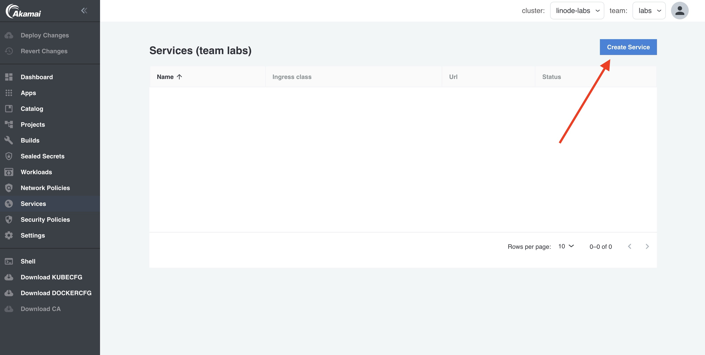
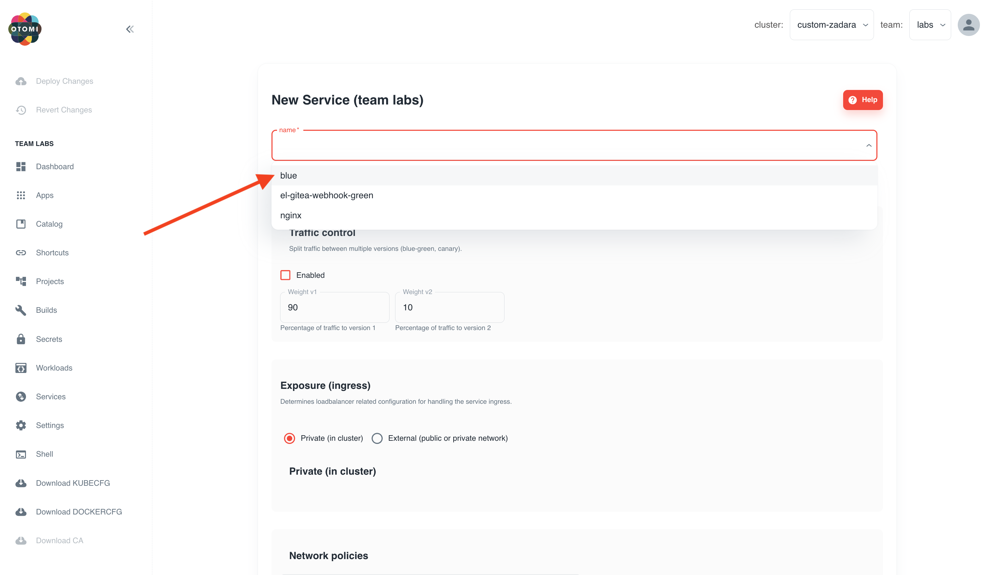
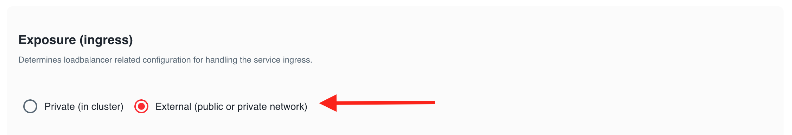

When you have deployed your application using the Workloads feature, you will probably like to expose it publicly. In this lab we'll create a Service in APL to expose your application publicly. When you create a Service, APL will create the Istio virtual service and configure ingress for your application.

## Create a Service

1. In the left menu panel under click `Services` then click on `Create Service`:

2. Select the `blue` service of the Workload we created in the previous lab:

3. Under `Exposure Ingress`, select `Ingress` and use the default configuration:

4. Click `Submit`.

5. Click `Deploy Changes` (the Deploy Changes button in the left panel will light-up after you click on submit).

Deploying changes in APL usually takes just a couple of minutes depending on the amount of resources available on your cluster. You will see your service in the list of Services. Click on the URL and see your application.