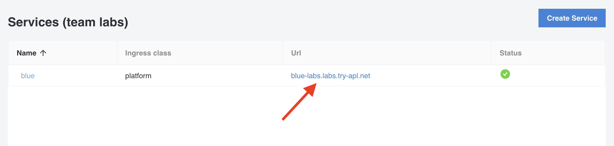

When you have deployed your application using the Workloads feature, you will probably like to expose it publicly. In this lab we'll create a Service to publicly expose your application. When you create a Service, the Istio virtual service and ingress resource for your application will be created automatically.

## Create a Service

1. In the left menu panel under click `Services` then click on `Create Service`:

2. Select the `blue` service of the workload created in the previous lab. The blue service will become available once the ArgoCD application is ready:

3. Under `Exposure Ingress`, select `External` and use the default configuration:

4. Click `Submit`.

You will see your service in the list of Services:

Click on the URL and see the blue application publicly exposed.
